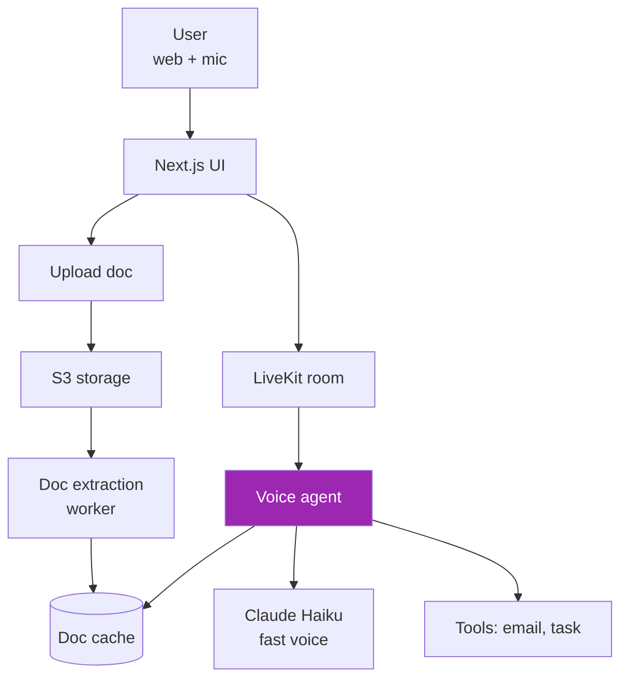

# Day 97: Mini-Project — Voice + Doc 🚀

<div class="lesson-meta">
⏱️ 5 ชั่วโมง &nbsp;|&nbsp; 📊 Project &nbsp;|&nbsp; 📋 Prerequisites: Week 13
</div>

## 🎯 Goal

Build voice-enabled document assistant:
- User uploads document via web
- Talks to voice agent about it
- Agent extracts key info on-the-fly
- Answers questions with citations
- Can take actions (email summary, create task)

---

## 1. Architecture



---

## 2. Document Upload Flow

```python
# api/upload.py
@app.post("/api/upload")
async def upload_doc(file: UploadFile, user=Depends(get_user)):
    # Save to S3
    doc_id = str(uuid.uuid4())
    s3.upload_fileobj(file.file, BUCKET, f"{user.id}/{doc_id}/{file.filename}")
    
    # Queue extraction
    extract_doc.delay(doc_id, user.id, file.filename)
    
    return {"doc_id": doc_id, "status": "processing"}

@celery_app.task
def extract_doc(doc_id, user_id, filename):
    # Download from S3
    local = download_from_s3(doc_id, user_id, filename)
    
    # Extract with agentic doc extraction
    from agentic_doc.parse import parse_documents
    result = parse_documents([local])[0]
    
    # Store extracted data + chunks for RAG
    redis.set(f"doc:{doc_id}:summary", result.markdown, ex=3600)
    redis.set(f"doc:{doc_id}:chunks", json.dumps([c.dict() for c in result.chunks]), ex=3600)
    redis.set(f"doc:{doc_id}:status", "ready")
```

---

## 3. Voice Agent with Doc Context

```python
# voice_agent.py
from livekit.agents import JobContext, llm
from livekit.agents.voice_assistant import VoiceAssistant
from livekit.plugins import anthropic, deepgram, elevenlabs, silero
import redis, json

redis_client = redis.Redis()

class DocTools(llm.FunctionContext):
    def __init__(self, doc_id):
        super().__init__()
        self.doc_id = doc_id
    
    @llm.ai_callable(description="Search the uploaded document for relevant content")
    async def search_document(self, query: str):
        chunks = json.loads(redis_client.get(f"doc:{self.doc_id}:chunks"))
        # Simple BM25-style search (can swap for embedding-based)
        ranked = rank_chunks(chunks, query)
        return [{"text": c["text"], "page": c.get("page")} for c in ranked[:3]]
    
    @llm.ai_callable(description="Send email summary to user")
    async def email_summary(self, recipient: str, subject: str):
        summary = redis_client.get(f"doc:{self.doc_id}:summary").decode()
        send_email(to=recipient, subject=subject, body=summary)
        return "sent"
    
    @llm.ai_callable(description="Create a task to follow up")
    async def create_task(self, title: str, due_date: str):
        # Use JIRA / Asana etc.
        task_id = create_in_pm_tool(title, due_date)
        return {"task_id": task_id}

async def entrypoint(ctx: JobContext):
    await ctx.connect()
    
    # Get doc_id from room metadata
    doc_id = ctx.room.metadata.get("doc_id")
    summary = redis_client.get(f"doc:{doc_id}:summary").decode()
    
    initial_ctx = llm.ChatContext().append(
        role="system",
        text=f"""You are a document assistant. The user uploaded a document.
        
Document summary:
{summary[:2000]}

Behavior:
- Be conversational and brief (voice format)
- Use search_document for specific questions
- Confirm before destructive actions (email, task)
- Cite pages when quoting"""
    )
    
    assistant = VoiceAssistant(
        vad=silero.VAD.load(),
        stt=deepgram.STT(),
        llm=anthropic.LLM(model="claude-haiku-4-5-20251001"),
        tts=elevenlabs.TTS(),
        chat_ctx=initial_ctx,
        fnc_ctx=DocTools(doc_id)
    )
    
    assistant.start(ctx.room)
    await assistant.say("I've reviewed your document. What would you like to know?")
```

---

## 4. UI Components

```tsx
// app/page.tsx
"use client";
import { useState } from "react";
import VoiceUI from "./VoiceUI";

export default function Page() {
  const [docId, setDocId] = useState<string | null>(null);
  const [status, setStatus] = useState("");

  async function handleUpload(file: File) {
    setStatus("uploading...");
    const fd = new FormData();
    fd.append("file", file);
    const r = await fetch("/api/upload", { method: "POST", body: fd });
    const { doc_id } = await r.json();
    
    // Poll for ready
    while (true) {
      const s = await fetch(`/api/upload/${doc_id}/status`);
      const { status } = await s.json();
      if (status === "ready") break;
      await new Promise(r => setTimeout(r, 1000));
    }
    
    setStatus("ready");
    setDocId(doc_id);
  }

  return (
    <div>
      {!docId ? (
        <input type="file" onChange={e => e.target.files && handleUpload(e.target.files[0])} />
      ) : (
        <VoiceUI docId={docId} />
      )}
      <p>{status}</p>
    </div>
  );
}
```

```tsx
// VoiceUI.tsx
function VoiceUI({ docId }) {
  const [token, setToken] = useState<string | null>(null);
  
  useEffect(() => {
    fetch(`/api/voice-token?doc_id=${docId}`)
      .then(r => r.json())
      .then(d => setToken(d.token));
  }, [docId]);
  
  if (!token) return <p>Connecting...</p>;
  
  return (
    <LiveKitRoom serverUrl={LIVEKIT_URL} token={token} connect={true} audio={true}>
      <RoomAudioRenderer />
      <BarVisualizer />
      <ControlBar />
    </LiveKitRoom>
  );
}
```

---

## 5. Mint Token with Doc Metadata

```python
@app.get("/api/voice-token")
def voice_token(doc_id: str, user=Depends(get_user)):
    token = api.AccessToken(LIVEKIT_API_KEY, LIVEKIT_API_SECRET)
    token.with_identity(user.id)
    token.with_grants(api.VideoGrants(
        room_join=True,
        room=f"doc-{doc_id}",
        can_publish=True,
        can_subscribe=True
    ))
    # Attach metadata so agent knows which doc
    token.with_metadata(json.dumps({"doc_id": doc_id, "user_id": user.id}))
    return {"token": token.to_jwt()}
```

---

## 6. Sample Conversations

```
User: "What's the total amount on this invoice?"
Agent: "The total is $4,250 on page 1, after the subtotal of $4,000 plus tax of $250."

User: "Send a summary to my boss bob@x.com"
Agent: "I'll send a summary to bob@x.com. Subject should be 'Invoice INV-2024-0823 summary' — confirm?"
User: "Yes"
Agent: "Sent."

User: "Create a task to pay this by Friday"
Agent: "Created task 'Pay invoice INV-2024-0823' due Friday."
```

---

## 7. Tests

```python
def test_doc_extracted():
    doc_id = upload_test_doc("sample-invoice.pdf")
    wait_until_ready(doc_id, timeout=30)
    summary = redis.get(f"doc:{doc_id}:summary")
    assert "Invoice" in summary

def test_voice_agent_answers():
    # Use LiveKit testing harness or mock
    doc_id = upload_test_doc("sample-invoice.pdf")
    transcript = simulate_voice_session(doc_id, [
        "What's the invoice total?",
        "Who is the vendor?"
    ])
    assert "$" in transcript[1]
    assert any(name_word in transcript[3] for name_word in ["Acme", "Vendor"])

def test_email_tool_confirms():
    transcript = simulate_voice_session(doc_id, [
        "Email summary to test@example.com"
    ])
    assert "confirm" in transcript[1].lower()
```

---

## 8. Deliverables

!!! example "Submit GitHub repo + video"
    1. Upload + extraction pipeline
    2. Voice agent (LiveKit)
    3. Doc search tool
    4. Email + task tools (with confirm)
    5. Web UI (upload + voice)
    6. Tests
    7. Demo video (5 min): upload → talk → email + task
    8. Architecture doc

---

## 9. Scoring Rubric

| เกณฑ์ | คะแนน |
|------|------|
| Doc extraction working | / 15 |
| Voice agent latency < 1.5s | / 15 |
| Search tool returns correct citations | / 15 |
| Email + task tools with confirmation | / 15 |
| Web UI smooth | / 10 |
| Tests (≥ 10) | / 10 |
| Demo quality | / 10 |
| Documentation | / 10 |
| **รวม** | **/ 100** |

---

## ✅ Week 13 Self-Check

- [x] LiveKit production voice
- [x] Google ADK familiarity
- [x] Voice latency + observability + compliance
- [x] Agentic Document Extraction
- [x] Tables, forms, key-value, charts
- [x] Voice + Doc combined app

---

## 🔍 Cross-check & References

- 📘 [LiveKit](https://docs.livekit.io/agents/)
- 📘 [LandingAI Agentic Doc](https://va.landing.ai/agentic-document-extraction)

---

:material-check-decagram: **จบ Week 13!** ก้าวสู่ Compliance & Governance

[ต่อไป → Week 14: Compliance :material-arrow-right:](../week-14/index.md){ .md-button .md-button--primary }
