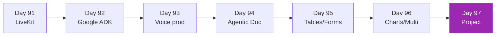

# Week 13: Specialized Agents — Voice + Doc 🎙️📄

Month 4 เริ่ม — ลึก 2 capabilities สำคัญสำหรับ enterprise

| Day | หัวข้อ | เวลา |
|-----|--------|------|
| 91 | LiveKit Agents deep | 4h |
| 92 | Google Agent Development Kit (ADK) | 3h |
| 93 | Voice production patterns | 3h |
| 94 | Agentic Document Extraction | 4h |
| 95 | Tables, forms, key-value extraction | 3h |
| 96 | Charts, diagrams, multi-modal docs | 3h |
| 97 | Mini-project — voice + doc workflow | 5h |

[เริ่ม Day 91 :material-arrow-right:](day-91.md){ .md-button .md-button--primary }
