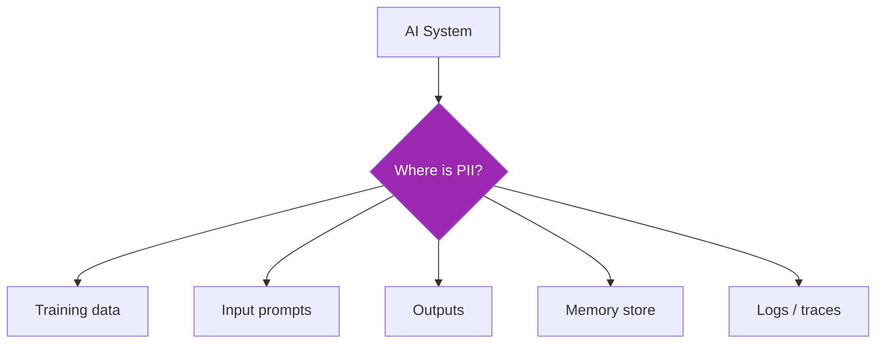

# Day 100: Data Privacy for AI 🔐

<div class="lesson-meta">
⏱️ 3 ชั่วโมง &nbsp;|&nbsp; 📊 Compliance &nbsp;|&nbsp; 📋 Prerequisites: Day 98-99
</div>

## 🎯 Learning Objectives

<ul class="objectives">
<li>PDPA Thailand + GDPR principles for AI</li>
<li>Lawful basis, consent, purpose limitation</li>
<li>Implement PII masking + tokenization</li>
<li>Right to delete in AI systems</li>
</ul>

---

## 1. PDPA Thailand Overview

**PDPA** = Personal Data Protection Act B.E. 2562 (2019), enforced from 2022

Core principles:
- **Lawful basis** required (consent, contract, legitimate interest, vital interest, public task, legal obligation)
- **Purpose limitation** — collect for specific stated purpose
- **Data minimization** — only what's necessary
- **Accuracy** — keep up to date
- **Storage limitation** — delete when no longer needed
- **Security** — appropriate measures
- **Accountability** — controller responsible

Penalties: Up to ฿5M + criminal liability for serious breaches

---

## 2. GDPR Comparison

| | PDPA (TH) | GDPR (EU) |
|--|-----------|-----------|
| Lawful bases | 6 (similar to GDPR) | 6 |
| Consent | explicit | explicit |
| Right to access | ✅ | ✅ |
| Right to delete | ✅ | ✅ |
| Right to portability | ✅ | ✅ |
| DPIA required | similar threshold | ✅ for high-risk |
| Breach notification | 72h to PDPC | 72h to supervisory authority |
| Penalty | up to ฿5M | up to €20M or 4% revenue |
| Extraterritorial | ✅ | ✅ |

---

## 3. Special Challenges for AI



PII can leak into:
1. **Training data** — covered by model provider (Anthropic)
2. **Your prompts** — your responsibility
3. **Outputs** — may include PII from RAG or hallucinations
4. **Memory** — long-term storage of user info
5. **Observability logs** — Langfuse/CloudWatch traces

→ Each surface needs control

---

## 4. PII Detection + Masking

```python
import re
from typing import Tuple

# Patterns (Thailand-aware)
PII_PATTERNS = {
    "th_id_card": r"\b\d{1}-\d{4}-\d{5}-\d{2}-\d{1}\b",  # Thai national ID
    "th_phone": r"\b(\+66|0)\d{8,9}\b",
    "email": r"[\w.+-]+@[\w-]+\.[\w.-]+",
    "credit_card": r"\b\d{4}[\s-]?\d{4}[\s-]?\d{4}[\s-]?\d{4}\b",
    "us_ssn": r"\b\d{3}-\d{2}-\d{4}\b",
    "iban": r"\b[A-Z]{2}\d{2}[A-Z0-9]{10,30}\b",
}

def mask_pii(text: str) -> Tuple[str, dict]:
    """Replace PII with tokens. Return masked text + token map."""
    token_map = {}
    masked = text
    counter = 0
    
    for name, pattern in PII_PATTERNS.items():
        for match in re.finditer(pattern, masked):
            counter += 1
            token = f"[{name.upper()}_{counter}]"
            token_map[token] = match.group()
            masked = masked.replace(match.group(), token, 1)
    
    return masked, token_map

# Usage in prompt
user_input = "My phone is 081-234-5678 and email john@example.com"
masked, tokens = mask_pii(user_input)
# masked: "My phone is [TH_PHONE_1] and email [EMAIL_2]"

# Send masked to LLM
resp = claude.messages.create(messages=[{"role": "user", "content": masked}])

# Optionally unmask before returning to user
final = resp.content[0].text
for token, original in tokens.items():
    final = final.replace(token, original)
```

→ LLM sees tokens, not real PII

---

## 5. Detection with Specialized Tools

For higher accuracy:

```python
# Microsoft Presidio
from presidio_analyzer import AnalyzerEngine
from presidio_anonymizer import AnonymizerEngine

analyzer = AnalyzerEngine()
anonymizer = AnonymizerEngine()

text = "John Smith called +66812345678 on Friday"
results = analyzer.analyze(text=text, language="en")
# → [{entity_type: PERSON, ...}, {entity_type: PHONE_NUMBER, ...}]

anonymized = anonymizer.anonymize(text=text, analyzer_results=results)
# → "<PERSON> called <PHONE_NUMBER> on Friday"
```

Other options:
- AWS Comprehend PII detection
- GCP DLP API
- Azure Content Safety

---

## 6. Consent Management

```python
class ConsentManager:
    """Track per-user consents for AI use"""
    
    PURPOSES = {
        "ai_chat": "Use AI to respond to your queries",
        "ai_memory": "Remember your preferences across sessions",
        "ai_training": "Use anonymized data to improve models",  # opt-in only
        "ai_analytics": "Aggregate usage for service improvement"
    }
    
    def record_consent(self, user_id, purpose, granted: bool, version: str):
        db.insert("consents", {
            "user_id": user_id,
            "purpose": purpose,
            "granted": granted,
            "version": version,  # ToS version
            "timestamp": now(),
            "ip": ...,
            "user_agent": ...
        })
    
    def has_consent(self, user_id, purpose):
        latest = db.query_latest("consents", user_id=user_id, purpose=purpose)
        return latest and latest["granted"]
    
    def revoke(self, user_id, purpose):
        self.record_consent(user_id, purpose, granted=False, version=current_version())
```

→ Audit trail of consent state over time

---

## 7. Right to Delete (Article 17 GDPR / PDPA equivalent)

```python
async def gdpr_delete_user(user_id):
    """Comprehensive deletion across all AI surfaces"""
    
    # 1. Database (transactional)
    db.delete("users", user_id=user_id)
    db.delete("messages", user_id=user_id)
    db.delete("consents", user_id=user_id)
    
    # 2. Long-term memory store
    await mem.delete_all(user_id=user_id)
    
    # 3. Vector DB (if user-specific embeddings)
    vector_db.delete(filter={"user_id": user_id})
    
    # 4. Object storage (uploads, transcripts)
    s3.delete_prefix(f"users/{user_id}/")
    
    # 5. Observability traces
    langfuse.delete_traces(user_id=user_id)
    
    # 6. Cache
    redis.delete_pattern(f"user:{user_id}:*")
    
    # 7. Backup deletion (if accessible)
    # Note: For backups with immutable retention, document in DPA
    
    # 8. Audit log
    audit_log({
        "action": "gdpr_delete",
        "user_id": user_id,
        "timestamp": now(),
        "performed_by": "system",
        "verified_surfaces": ["db", "mem", "vector", "s3", "langfuse", "cache"]
    })
    
    return {"status": "deleted"}
```

⚠️ Backups & immutable logs: typically excluded but must be documented in DPA + Privacy Policy

---

## 8. Right to Access

```python
async def gdpr_export_user(user_id) -> dict:
    """Export all user data — machine-readable format"""
    return {
        "profile": db.fetch_user(user_id),
        "conversations": db.fetch_messages(user_id),
        "memories": mem.get_all(user_id=user_id),
        "consents": db.fetch_consents(user_id),
        "uploaded_documents": list_s3_files(f"users/{user_id}/"),
        "ai_interactions_summary": {
            "total_queries": count_queries(user_id),
            "first_query": first_query_date(user_id)
        }
    }
```

Deliver as:
- Downloadable JSON
- Self-serve dashboard (better UX)
- Email response (acceptable but slower)

---

## 9. DPIA — Data Protection Impact Assessment

Required (GDPR) for high-risk processing — many AI use cases qualify

### DPIA Template

```markdown
# DPIA — Customer Support AI Bot

## Step 1: Necessity
- Purpose: assist customers 24/7
- Why AI: scale, multilingual, 24/7
- Alternatives considered: more human agents (cost prohibitive)

## Step 2: Data Flow
[Diagram of data flow]

## Step 3: Categories of Data
- Customer name, email
- Conversation content (may contain account info)
- Usage logs
- (Maybe inferred: location from IP, sentiment)

## Step 4: Lawful Basis
- Contract performance (Art 6(1)(b))
- For analytics: legitimate interest (Art 6(1)(f))

## Step 5: Risks Identified
| Risk | Likelihood | Impact | Mitigation |
|------|-----------|--------|-----------|
| PII in LLM logs | M | H | Mask before LLM, no PII in observability |
| Cross-customer leak | L | H | Tenant isolation in RAG |
| Hallucinated PII | L | M | Output filter + judge |

## Step 6: Consultation
- Internal: Legal, InfoSec, AI Lead
- External: (high risk → consult supervisory authority)

## Step 7: Sign-off
- DPO: <name, date>
```

---

## 10. Cross-Border Data Transfers

Thailand → EU: PDPA allows with adequacy or contractual safeguards  
EU → Thailand: EU requires SCCs (Standard Contractual Clauses) since Thailand has no adequacy decision  
US → EU: EU-US Data Privacy Framework (post-Schrems II)

For AI providers:
- Anthropic: US-based, EU customers use SCCs
- AWS Bedrock: region-specific data storage (EU regions for EU residents)

→ Choose region carefully + put SCCs in DPA

---

## 🛠️ Hands-on Exercise

!!! example "Exercise 1: PII Mask Library"
    Build PII masker with 6 patterns + token map → unmask

!!! example "Exercise 2: Consent UI"
    Build consent form with 3 purposes (chat, memory, analytics) + opt-in/out flow

!!! example "Exercise 3: Deletion Flow"
    Implement gdpr_delete_user across 5+ surfaces of your capstone

---

## ✅ Self-Check Quiz

<div class="quiz">

**Q1:** ทำไม mask ก่อน LLM?

??? success "ดูคำตอบ"
    - LLM อาจ log/cache prompt internally (some providers do)
    - Output อาจ echo PII
    - Reduces PII propagation surface
    - Compliance: easier audit (data minimization principle)

**Q2:** Right to delete — challenging where?

??? success "ดูคำตอบ"
    - Backups (immutable retention)
    - Training datasets (if any data fed back)
    - Vector embeddings (must filter+delete)
    - Long-term memory (often forgotten)
    - 3rd-party processor data
    - Document allowed exclusions in DPA

</div>

---

## 🔍 Cross-check & References

- 📘 [PDPA Thailand official](https://www.pdpc.or.th/)
- 📘 [GDPR full text](https://gdpr.eu/)
- 📦 [Microsoft Presidio](https://github.com/microsoft/presidio)
- 📘 [Anthropic DPA](https://www.anthropic.com/legal/dpa)

[ต่อไป → Day 101: HIPAA + Sectoral :material-arrow-right:](day-101.md){ .md-button .md-button--primary }
