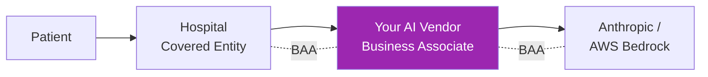

# Day 101: Sector-Specific Regulations 🏥

<div class="lesson-meta">
⏱️ 3 ชั่วโมง &nbsp;|&nbsp; 📊 Compliance &nbsp;|&nbsp; 📋 Prerequisites: Day 100
</div>

## 🎯 Learning Objectives

<ul class="objectives">
<li>HIPAA basics for AI + BAA</li>
<li>PCI DSS implications for voice/chat agents</li>
<li>SOX for AI in financial reporting</li>
<li>FERPA for education AI</li>
</ul>

---

## 1. HIPAA — Healthcare

**HIPAA** = Health Insurance Portability and Accountability Act (US)

Applies if your AI:
- Processes Protected Health Information (PHI)
- Serves "covered entities" (hospitals, payers) or "business associates"

### Key Concepts

- **PHI** = any health info linked to individual
- **Covered Entity (CE)**: providers, payers, clearinghouses
- **Business Associate (BA)**: vendors handling PHI for CE
- **BAA**: contract between CE and BA defining responsibilities



→ Need BAA chain: CE → you → Anthropic/AWS

---

## 2. HIPAA Safeguards (Required)

### Administrative
- Designate Privacy Officer + Security Officer
- Workforce training
- Access management (least privilege)
- Incident response procedures
- BAAs with all subcontractors

### Physical
- Facility access control
- Workstation use policies
- Device & media controls (encryption at rest)

### Technical
- Access control (unique IDs, encryption)
- Audit controls (logs of PHI access)
- Integrity (no unauthorized changes)
- Transmission security (encryption in transit)

---

## 3. AI Use Cases in Healthcare

| Use case | Risk | Considerations |
|---------|------|---------------|
| Clinical decision support | High | FDA SaMD regulation, MUST keep MD in loop |
| Patient chatbot (FAQ) | Medium | BAA, PHI minimization |
| Medical scribe (transcription) | High | Audio recording consent, accuracy |
| Claims processing | Medium | Bias risk (denial patterns) |
| Drug discovery | Low | Often pre-PHI |
| Hospital ops (scheduling) | Low | Indirect PHI |

---

## 4. Anthropic + AWS HIPAA Path

Currently:
- **Anthropic Direct API**: BAA available with Enterprise plan — confirm with Anthropic sales
- **AWS Bedrock**: HIPAA eligible with AWS BAA (signed via AWS Artifact)
- **GCP Vertex**: HIPAA eligible (GCP BAA)
- **Azure Foundry**: HIPAA eligible (MS BAA)

**Important** — verify directly with each provider; coverage evolves

### Minimum PHI Handling

```python
def safe_phi_pipeline(patient_query):
    # 1. Strip identifiers if possible
    deidentified = deidentify_safe_harbor(patient_query)
    
    # 2. Or tokenize (reversible if necessary)
    tokenized, token_map = tokenize_phi(patient_query)
    
    # 3. Send to LLM (in BAA-covered tenant)
    resp = bedrock_claude(tokenized)
    
    # 4. Re-identify if needed
    final = detokenize(resp, token_map)
    
    # 5. Audit log (PHI-aware)
    audit_phi_access(user_id, patient_id, action="ai_query")
    
    return final
```

---

## 5. Safe Harbor De-identification

HIPAA Safe Harbor: remove 18 identifiers:
- Names
- Geographic subdivisions smaller than state
- Dates (except year) of birth, admission, etc.
- Phone, fax, email
- SSN
- Medical record numbers
- Health plan numbers
- Account numbers
- Certificate/license numbers
- Vehicle identifiers
- Device identifiers
- URLs / IPs
- Biometric identifiers
- Photos
- Any other unique identifier

→ Post de-id: data treated as non-PHI

```python
PHI_PATTERNS = {
    "us_phone": r"\b(?:\+1[\s-]?)?\(?\d{3}\)?[\s.-]?\d{3}[\s.-]?\d{4}\b",
    "ssn": r"\b\d{3}-\d{2}-\d{4}\b",
    "mrn": r"\bMRN[:\s]?\d{6,}\b",
    "dob": r"\b(0[1-9]|1[0-2])/(0[1-9]|[12]\d|3[01])/\d{4}\b",
    "zip5": r"\b\d{5}(-\d{4})?\b",  # may keep first 3 digits per safe harbor
}
```

⚠️ Safe Harbor is strict — most "casual" anonymization fails. Either follow precisely OR use Expert Determination method.

---

## 6. PCI DSS — Payment Card

If voice/chat agent might hear/see CC data:

### Scope minimization (BEST)
- Don't bring CC into your system
- Transfer to PCI-compliant IVR for transaction
- AI agent only handles non-payment context

### If in scope
- PCI DSS controls apply
- Tokenize CC immediately (no storage of PAN)
- Encrypt during transmission
- Restrict access
- Logging + monitoring
- Annual external audit (Level 1)

```python
def detect_and_redact_cc(text):
    # Luhn validation
    pattern = r"\b\d{4}[\s-]?\d{4}[\s-]?\d{4}[\s-]?\d{4}\b"
    redacted = re.sub(pattern, "[CC_REDACTED]", text)
    return redacted

# In voice agent: detect at STT layer, redact before LLM + storage
```

---

## 7. SOX — Sarbanes-Oxley (Financial Reporting)

For public companies in US (also Thailand SOX-equivalent for SET-listed):

AI implications:
- AI-generated financial reports / projections
- AI-assisted journal entries
- AI fraud detection

Controls needed:
- Reproducibility — same input → same output (or logged seed)
- Audit trail of AI's role
- Human review + sign-off
- Model validation by independent reviewers
- Documentation of AI use in financial process

```python
# SOX-compliant logging
def sox_audit_ai_decision(transaction_id, ai_decision, ai_reasoning, human_reviewer):
    audit_log({
        "system": "ai_finance_assistant",
        "transaction_id": transaction_id,
        "model": "claude-sonnet-4-6@2026-05-01",  # pinned version
        "ai_output": ai_decision,
        "ai_reasoning": ai_reasoning,  # full chain of thought
        "human_reviewer": human_reviewer,
        "review_decision": "approved|rejected|modified",
        "modifications": ...,
        "timestamp": now(),
        "checksum": hash_of_above  # tamper-proof
    })
```

---

## 8. FERPA — Education

US: protects student educational records.
Similar in other countries (e.g., Thailand has student data under PDPA broadly).

For AI in education:
- Consent from parents for under-18
- Don't share student records with vendors without proper agreements
- AI grading: students have right to challenge
- Be careful with biometric data (face attendance, etc.)

---

## 9. Financial Services — Additional

### Anti-Money Laundering (AML)
- AI in transaction monitoring
- Document model decisions for regulator
- Explainability requirement (why flagged?)

### Fair Lending (US)
- ECOA: no discrimination on protected classes
- AI underwriting models must demonstrate fairness
- Adverse Action Notices: cite specific reasons (not "AI said no")

### Suitability (Investment)
- AI investment advice must consider client suitability
- Disclosure: "AI-generated, consult professional"

---

## 10. Compliance Matrix

```markdown
# Sectoral Compliance Matrix — Project X

| Sector | Regulation | Applies? | Mitigation |
|--------|-----------|---------|-----------|
| Healthcare | HIPAA | Yes (PHI in inputs) | BAA chain + Safe Harbor + audit |
| Healthcare | FDA SaMD | No (not diagnostic) | N/A |
| Finance | PCI DSS | Partial (voice agent may hear CC) | Scope minimization + redaction |
| Finance | SOX | Yes (AI summaries fed into reports) | Reviewer approval + audit |
| Education | FERPA | No (not edu data) | N/A |
| All | PDPA | Yes | Day 100 controls |
| All | EU AI Act | Yes (limited risk) | Transparency notices |
```

---

## 🛠️ Hands-on Exercise

!!! example "Exercise 1: BAA Checklist"
    Create BAA checklist for your project's vendor chain

!!! example "Exercise 2: Safe Harbor Tool"
    Build de-identification tool for 8 HIPAA identifiers

!!! example "Exercise 3: PCI Scope"
    Design voice agent flow that handles "I want to pay" → minimize PCI scope

---

## ✅ Self-Check Quiz

<div class="quiz">

**Q1:** BAA chain ทำงานยังไง?

??? success "ดูคำตอบ"
    Hospital (CE) → signs BAA with → Your company (BA) → must sign BAA with → Anthropic/AWS (sub-processors). Each link required. Without any link → non-compliant chain.

**Q2:** Why PCI "scope minimization"?

??? success "ดูคำตอบ"
    PCI compliance is expensive + ongoing (annual audits, controls, monitoring). Keeping CC out of your system reduces audit scope dramatically — only payment IVR is "in scope", not your AI system.

</div>

---

## 🔍 Cross-check & References

- 📘 [HIPAA Privacy + Security Rules](https://www.hhs.gov/hipaa/)
- 📘 [PCI DSS](https://www.pcisecuritystandards.org/)
- 📘 [AWS HIPAA Eligible Services](https://aws.amazon.com/compliance/hipaa-eligible-services-reference/)

[ต่อไป → Day 102: Carbon Footprint :material-arrow-right:](day-102.md){ .md-button .md-button--primary }
