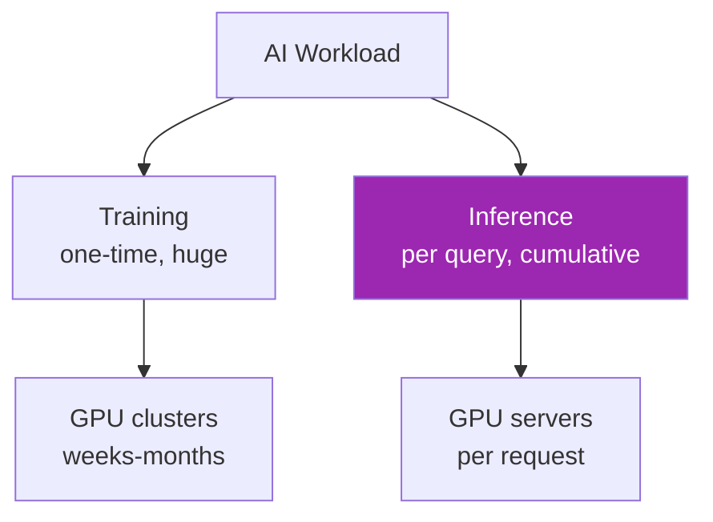
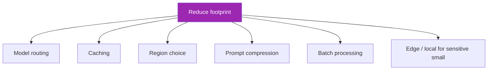
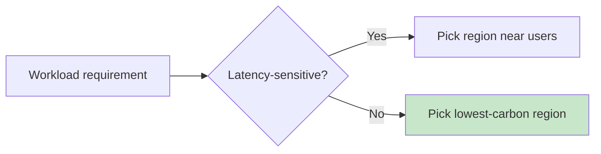

# Day 102: Carbon Footprint of AI 🌍

<div class="lesson-meta">
⏱️ 3 ชั่วโมง &nbsp;|&nbsp; 📊 Sustainability &nbsp;|&nbsp; 📋 Prerequisites: Day 80
</div>

## 🎯 Learning Objectives

<ul class="objectives">
<li>เข้าใจ energy + emissions ของ AI workloads</li>
<li>Estimate footprint ของ your app</li>
<li>เห็น cost-emission trade-offs</li>
</ul>

---

## 1. Where AI Energy Goes



**For users of hosted Claude**: training cost is sunk (Anthropic absorbs). You pay for **inference**.

---

## 2. Inference Footprint Estimation

Rough formula:

```
Energy per request (Wh) = 
  (input_tokens + output_tokens) × J_per_token / 3600

Where J_per_token varies by model:
- Small (Haiku-like): ~0.5-2 J/token
- Medium (Sonnet-like): ~2-10 J/token  
- Large (Opus-like): ~10-50 J/token

CO2e per request = Energy × grid_intensity (gCO2/kWh)
```

⚠️ These numbers vary substantially. Anthropic doesn't publish exact figures — these are estimates from ML community + similar models.

### Grid Intensity (gCO2/kWh)

| Region | Intensity |
|--------|-----------|
| Sweden | 8 |
| France | 80 |
| US average | 380 |
| US Texas (gas-heavy) | 450 |
| Australia | 660 |
| India | 700 |
| Thailand | ~500 |

→ Same workload in Sweden = ~80x less CO2 than Australia

---

## 3. Rough Calculator

```python
GRID_INTENSITY_G_CO2_PER_KWH = {
    "us-east-1": 350,
    "us-west-2": 100,  # Oregon (hydro)
    "eu-west-1": 280,  # Ireland
    "eu-north-1": 35,   # Stockholm (clean)
    "ap-southeast-1": 500,  # Singapore
}

ENERGY_J_PER_TOKEN = {
    "haiku": 1.0,
    "sonnet": 5.0,
    "opus": 25.0
}

def estimate_emissions(model, input_tokens, output_tokens, region):
    j_per = ENERGY_J_PER_TOKEN[model]
    energy_wh = (input_tokens + output_tokens) * j_per / 3600
    energy_kwh = energy_wh / 1000
    intensity = GRID_INTENSITY_G_CO2_PER_KWH[region]
    co2_g = energy_kwh * intensity
    return co2_g

# 1000 queries (Sonnet) with 4K input + 500 output in US East
co2_g_per_query = estimate_emissions("sonnet", 4000, 500, "us-east-1")
total_kg = co2_g_per_query * 1000 / 1000
print(f"~{total_kg:.2f} kg CO2e for 1000 queries")
```

---

## 4. Compare with Other Activities

To put it in context (very rough):

| Activity | CO2e (g) |
|----------|----------|
| 1 LLM query (Sonnet, 4K tokens) | ~1-5g |
| 1 Google search | ~0.2g |
| 1 hour of video streaming (HD) | ~36g |
| 1 km car drive | ~120g |
| 1 lunch (meat) | ~3000g |

→ Per-query small, but at scale (millions/day) = real

---

## 5. CO2 at Scale

```python
# Your service: 1M queries/day, Sonnet, 4K avg input, 500 output
daily_co2_g = 1_000_000 * estimate_emissions("sonnet", 4000, 500, "us-east-1")
daily_kg = daily_co2_g / 1000
yearly_t = daily_kg * 365 / 1000

print(f"Daily: {daily_kg:.0f} kg CO2e")
print(f"Yearly: {yearly_t:.0f} metric tons CO2e")

# Equivalent
print(f"Equivalent to {yearly_t / 4.6:.0f} average cars driven for a year")
```

→ Visible footprint that customers + sustainability reports care about

---

## 6. Reduction Levers



| Lever | CO2 saved |
|-------|----------|
| Route 70% to Haiku | ~70% (vs Opus) |
| Caching (30% hit) | ~30% |
| Pick clean region (us-west-2 vs us-east-1) | ~70% per query |
| Prompt compression (30%) | ~30% input tokens |
| Batch API (when delay OK) | similar reasoning |

→ Same levers ที่ saved cost (Day 80) มัก save carbon

---

## 7. Region Selection



Cleanest AWS regions (approximate):
- us-west-2 (Oregon — hydro)
- eu-north-1 (Stockholm — wind/hydro)
- ca-central-1 (Quebec — hydro)
- eu-west-1 (Ireland — wind)

⚠️ Verify with AWS Customer Carbon Footprint Tool — region grid mix changes annually

---

## 8. Anthropic + Cloud Sustainability

- **Anthropic**: committed to using renewable energy where available (verify on their sustainability page)
- **AWS**: matched 100% renewable energy in 2023 (claims; investigate methodology)
- **GCP**: claims carbon-free energy by 2030 24/7 in some regions
- **Azure**: 100% renewable globally by 2025 (claim)

Marketing claims need scrutiny:
- "Carbon neutral" usually = offsets purchased (not zero emissions)
- "100% renewable" usually = annual energy match (not hourly)
- **24/7 carbon-free** is the strongest standard (matched hourly)

---

## 9. Carbon Reporting

For sustainability reports:

```python
def quarterly_carbon_report():
    return {
        "total_inference_tokens": get_total_tokens_q(),
        "by_model": {
            "haiku": get_tokens("haiku"),
            "sonnet": get_tokens("sonnet"),
            "opus": get_tokens("opus")
        },
        "estimated_kwh": calc_total_energy(),
        "estimated_co2e_kg": calc_total_co2(),
        "region_breakdown": {...},
        "offsets_purchased_kg": ...,
        "net_emissions_kg": ...,
        "methodology": "v1.2 (link to doc)",
        "limitations": "Estimate from token counts; provider exact figures not disclosed"
    }
```

→ Honest reporting > over-claiming. ESG-aware customers check methodology.

---

## 10. Carbon-Aware Workload Scheduling

For batch / non-urgent work:

```python
import requests

def get_grid_carbon_intensity(region):
    # Free APIs: ElectricityMap, WattTime
    r = requests.get(f"https://api.electricitymap.org/v3/carbon-intensity/latest?zone={region}")
    return r.json()["carbonIntensity"]

def schedule_batch_when_clean(threshold=200):
    current = get_grid_carbon_intensity("US-OR")
    if current < threshold:
        kick_off_batch_jobs()
    else:
        # delay 1h, recheck
        schedule_in(3600)
```

→ Run heavy batch processing when grid is cleanest (typically when wind/solar peak)

---

## 🛠️ Hands-on Exercise

!!! example "Exercise 1: Estimate Your Footprint"
    Calculate yearly CO2 for your capstone (or hypothetical 100K MAU service)

!!! example "Exercise 2: Region Comparison"
    Compare same workload in 4 regions — pick optimal

!!! example "Exercise 3: Reduction Plan"
    Identify 3 levers + estimate savings (% + kg CO2/year)

---

## ✅ Self-Check Quiz

<div class="quiz">

**Q1:** ทำไม region choice มี impact ใหญ่?

??? success "ดูคำตอบ"
    Grid intensity ต่างกัน 50-100x ระหว่าง regions (e.g., Sweden 8 vs Australia 660 g/kWh) — same compute, very different emissions

**Q2:** "Carbon neutral" claim — ระวัง?

??? success "ดูคำตอบ"
    Often via offsets (questionable additionality, permanence)
    "24/7 carbon-free" = matched hourly with clean energy = much stronger
    Check methodology doc

</div>

---

## 🔍 Cross-check & References

- 📘 [AWS Customer Carbon Footprint Tool](https://aws.amazon.com/aws-cost-management/aws-customer-carbon-footprint-tool/)
- 📘 [Anthropic Sustainability](https://www.anthropic.com/sustainability) (check for latest)
- 📦 [Electricity Maps API](https://www.electricitymaps.com/)
- 📄 [Green Algorithms](https://www.green-algorithms.org/)

[ต่อไป → Day 103: Green AI Patterns :material-arrow-right:](day-103.md){ .md-button .md-button--primary }
