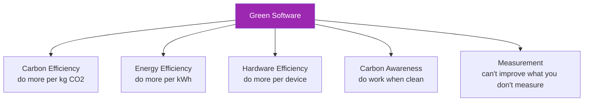

# Day 103: Green AI Patterns 🌱

<div class="lesson-meta">
⏱️ 3 ชั่วโมง &nbsp;|&nbsp; 📊 Sustainability &nbsp;|&nbsp; 📋 Prerequisites: Day 102
</div>

## 🎯 Learning Objectives

<ul class="objectives">
<li>Apply Green AI patterns ใน design</li>
<li>Measure baseline + improvements</li>
<li>Embed sustainability ใน SLOs</li>
</ul>

---

## 1. Green Software Foundation Principles



---

## 2. Pattern: Right-Size Model

```python
def pick_model(task_complexity, latency_sla):
    """Choose smallest model that meets requirements"""
    if task_complexity == "simple" and latency_sla < 1000:
        return "claude-haiku-4-5-20251001"  # ~5x less energy than Sonnet
    elif task_complexity == "medium":
        return "claude-sonnet-4-6"
    else:
        return "claude-opus-4-7"  # only if necessary
```

> "Use the smallest tool that fits" — same advice for ML and for green

---

## 3. Pattern: Aggressive Caching

```python
# Multi-tier cache
@cache.cached(ttl=3600, key_prefix="ai:exact")
def exact_answer(q):
    return ai_call(q)

@semantic_cache.cached(threshold=0.92)
def semantic_answer(q):
    return ai_call(q)

@embedding_cache.cached()  # for repeated context
def get_embeddings(text):
    return embed(text)
```

Reasonable cache hit rates can avoid significant energy use. Even 20-30% hit = real impact at scale.

---

## 4. Pattern: Lazy / Just-In-Time RAG

Don't pre-fetch big context if not needed:

```python
# ❌ Wasteful: always fetch 20 chunks
def answer_v1(q):
    chunks = retrieve(q, k=20)
    context = "\n".join(chunks)
    return ai_call(f"Q: {q}\nContext: {context}")

# ✅ Lazy: fetch + iterate
def answer_v2(q):
    chunks = retrieve(q, k=5)
    answer = ai_call(f"Q: {q}\nContext: {chunks[:3]}")
    
    if needs_more(answer):
        # only fetch + call again if insufficient
        more = retrieve(q, k=10, exclude_seen=chunks)
        answer = ai_call(f"Q: {q}\nContext: {chunks + more}")
    
    return answer
```

→ Smaller average context = less compute per query

---

## 5. Pattern: Prompt Compression

```python
from llmlingua import PromptCompressor
compressor = PromptCompressor()

def green_prompt(original, target_rate=0.6):
    if len(original) < 1000:
        return original  # not worth compressing small
    
    compressed = compressor.compress_prompt(original, rate=target_rate)
    return compressed["compressed_prompt"]
```

→ Less tokens in = less energy per inference

---

## 6. Pattern: Streaming Stop-Early

```python
async def streaming_with_stop(query):
    """Stop generation early if we have enough"""
    with claude.messages.stream(...) as stream:
        accumulated = ""
        for text in stream.text_stream:
            accumulated += text
            yield text
            
            # Check if we have complete answer (custom logic)
            if has_complete_answer(accumulated):
                stream.close()  # stop generation
                break
```

→ Don't generate full max_tokens if answer is done

---

## 7. Pattern: Batch Processing (Off-Peak / Clean)

For non-urgent (eval, analytics, data processing):

```python
import datetime

def schedule_batch_green(batch_id, region="us-west-2"):
    # Check current grid intensity
    intensity = get_grid_intensity(region)
    
    # If below threshold OR off-peak hours → run
    is_offpeak = datetime.datetime.now().hour in [2, 3, 4, 5]
    if intensity < 150 or is_offpeak:
        submit_batch(batch_id)
    else:
        schedule_in(3600)  # try again in 1h
```

Anthropic Batch API: typically 50% cost off, gives provider flexibility to run during clean hours

---

## 8. Pattern: Distillation (Advanced)

For specific tasks (e.g., classification):
- Train smaller specialized model on Claude's outputs
- Use smaller model in production
- Use Claude only for hard cases / new types

```python
def smart_route(text):
    # 1. Try smaller specialized model first
    confidence, label = distilled_classifier.predict(text)
    
    if confidence > 0.9:
        return label  # done — much less energy
    
    # 2. Fallback to Claude only when uncertain
    return claude_classify(text)
```

→ Can cut LLM calls by 80-95% for classification workloads

---

## 9. Pattern: Edge / Local for Sensitive Small Tasks

Some operations can run on user's device:
- PII detection (regex / Presidio)
- Basic classification
- Templated responses

```python
# Frontend (browser): regex PII check before sending
function maskPIIBeforeSend(text) {
    return text
        .replace(/\b\d{4}[\s-]?\d{4}[\s-]?\d{4}[\s-]?\d{4}\b/g, '[CC]')
        .replace(/[\w.+-]+@[\w-]+\.[\w.-]+/g, '[EMAIL]');
}
```

→ Skip network + LLM for trivial decisions

---

## 10. SLOs with Sustainability

```markdown
# SLOs — including sustainability

## Performance
- Latency P95 < 3s
- Availability 99.5%

## Sustainability
- gCO2e/query ≤ 5 (target)
- Cache hit rate ≥ 30%
- % requests routed to Haiku ≥ 60%
- Region carbon intensity weighted-avg ≤ 200 g/kWh

## Cost (correlated)
- Cost per query ≤ $0.05
- Cost per user/day ≤ $1
```

---

## 11. Carbon Dashboard

```python
# Track per-request carbon
def record_request(query, model, region, input_tokens, output_tokens):
    co2 = estimate_emissions(model, input_tokens, output_tokens, region)
    
    prometheus.observe("ai_co2_grams", co2)
    prometheus.inc("ai_requests_total", labels={"model": model, "region": region})
    
    # Daily roll-up
    daily_co2_kg = sum_today() / 1000
    if daily_co2_kg > daily_co2_budget:
        alert("CO2 budget exceeded")
```

Grafana panel ideas:
- Total CO2 (rolling)
- CO2 per request (by model)
- Region split
- Trend vs last week
- Cumulative offsets purchased

---

## 12. Embed in Procurement

When selecting AI vendor or infra:

```markdown
## Vendor Sustainability Criteria
- [ ] Discloses emissions methodology
- [ ] Uses ≥ 80% renewable
- [ ] Region selection respects user latency requirements
- [ ] Reports per-call energy (when available)
- [ ] Commits to 24/7 carbon-free goal
```

---

## 🛠️ Hands-on Exercise

!!! example "Exercise 1: Greener Refactor"
    Take Day 35 RAG → apply 3 green patterns → measure delta in tokens (proxy for energy)

!!! example "Exercise 2: Distillation Eval"
    Train a small classifier on Claude's labels for one classification task → measure where it falls below threshold → calculate % LLM-call reduction

!!! example "Exercise 3: SLO Add"
    Add sustainability SLOs to your Day 81 runbook

---

## ✅ Self-Check Quiz

<div class="quiz">

**Q1:** Right-size model — รากของ green AI?

??? success "ดูคำตอบ"
    ใช่ — bigger models cost ~5-50x more energy per token. ใช้ Haiku สำหรับ work ที่ Haiku ทำได้ = ลด energy + cost พร้อมกัน ใหญ่ที่สุด lever ง่ายที่สุด

**Q2:** Distillation เหมาะกับ task แบบไหน?

??? success "ดูคำตอบ"
    - Stable task definition
    - Large volume (justifies training cost)
    - Discrete output space (classification, NER)
    - Labeled data available (or generate from Claude)
    - **Not** for: open-ended generation, evolving requirements

</div>

---

## 🔍 Cross-check & References

- 📘 [Green Software Foundation](https://greensoftware.foundation/)
- 📺 [Green Software Practitioner Course](https://learn.greensoftware.foundation/)
- 📄 [Patterns Catalog](https://patterns.greensoftware.foundation/)

[ต่อไป → Day 104: Audit Template :material-arrow-right:](day-104.md){ .md-button .md-button--primary }
