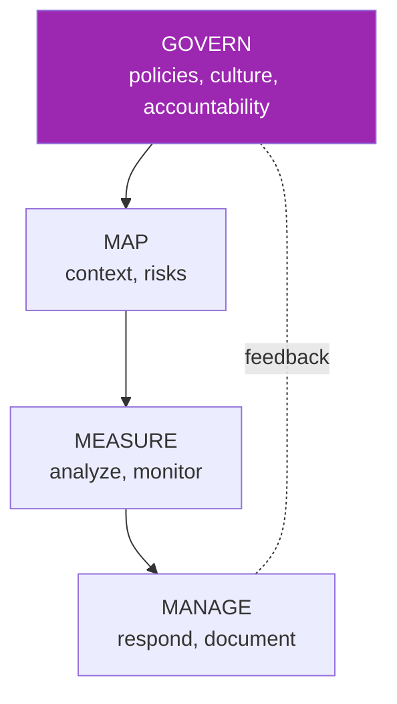
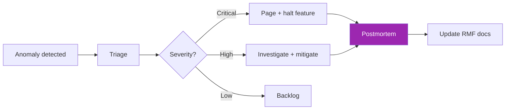

# Day 98: NIST AI RMF 🏛️

<div class="lesson-meta">
⏱️ 3 ชั่วโมง &nbsp;|&nbsp; 📊 Governance &nbsp;|&nbsp; 📋 Prerequisites: Day 30
</div>

## 🎯 Learning Objectives

<ul class="objectives">
<li>เข้าใจ NIST AI RMF 4 functions</li>
<li>Map AI risks ของ project ตาม framework</li>
<li>Implement RMF lite สำหรับ team</li>
</ul>

---

## 1. NIST AI RMF Overview

NIST = National Institute of Standards and Technology (USA)  
AI RMF = voluntary framework for trustworthy AI, published 2023



4 core functions ทำงานร่วมกันต่อเนื่อง

---

## 2. GOVERN — Organizational Foundation

**Goal**: AI accountable, with clear policies + roles

Activities:
- AI policy / acceptable use
- Roles: AI lead, ethics committee, on-call
- Risk tolerance defined
- Workforce training
- Vendor / 3rd-party management

### Document Template

```markdown
# AI Governance Charter

## Purpose
This charter defines how we manage AI risks and ensure responsible use.

## Scope
All AI/LLM applications built or operated by <Org>.

## Roles
- **AI Lead**: <name>, owns AI strategy
- **Ethics Committee**: monthly review of new use cases
- **AI Risk Officer**: tracks risk register
- **Engineering Lead**: implements technical controls

## Policies
1. All AI use cases must be approved by Ethics Committee
2. PII data must be tokenized before LLM
3. Human-in-the-loop required for: medical, legal, financial decisions
4. ...
```

---

## 3. MAP — Context & Risks

**Goal**: understand what you're deploying + what could go wrong

### Use Case Card Template

```markdown
# Use Case: <name>

## Description
What does it do? Who uses it?

## AI System
- Model: Claude Sonnet 4.6 via Bedrock
- Training data: pre-trained foundation model (Anthropic)
- Fine-tuning: none / prompt engineered only
- Knowledge base: <KB source, last refresh>

## Stakeholders
- Users: <persona, # of users>
- Affected parties: <who else>
- Decision-makers: <who acts on output>

## Potential Harms
| Harm | Likelihood | Impact | Score |
|------|-----------|--------|-------|
| Inaccurate medical advice | M | H | 12 |
| Biased hiring decision | L | C | 12 |
| Data leak via output | L | H | 8 |
| ... |

## Controls Required
- Human review before action
- Audit log
- Bias testing on protected attributes
- PII filter
```

---

## 4. MEASURE — Analyze & Monitor

**Goal**: continuously assess risks with metrics

Metrics to track:

```python
RMF_METRICS = {
    # Performance
    "accuracy_against_ground_truth": "≥ 0.85",
    "latency_p95": "≤ 3s",
    
    # Fairness
    "demographic_parity_diff": "≤ 0.05",
    "equal_opportunity_diff": "≤ 0.05",
    
    # Safety
    "harmful_output_rate": "≤ 0.001",
    "guardrail_bypass_rate": "≤ 0.02",
    "hallucination_rate": "≤ 0.05",
    
    # Privacy
    "pii_leak_count": "= 0",
    "data_retention_compliance": "100%",
    
    # Reliability
    "uptime": "≥ 99.5%",
    "incident_count_severity_1": "= 0 / quarter"
}
```

### Bias Testing Example

```python
def test_demographic_parity(model, test_set):
    """Check approval rate by demographic group"""
    groups = group_by(test_set, "demographic")
    rates = {g: approval_rate(model, group) for g, group in groups.items()}
    
    max_rate = max(rates.values())
    min_rate = min(rates.values())
    
    parity_diff = max_rate - min_rate
    assert parity_diff <= 0.05, f"Bias detected: {rates}"
```

---

## 5. MANAGE — Respond & Document

**Goal**: act on findings, document for audit

### Incident Response



### Documentation Required

- Model card (for each LLM use case)
- System card (for the full app)
- Data sheet (for each KB source)
- Risk register (live)
- Decisions log (ADRs)
- Incident log
- Audit log of model changes

---

## 6. Model Card Example

```markdown
# Model Card — Customer Support Bot v2.3

## Model
- Foundation: Claude Sonnet 4.6
- Provider: Anthropic via AWS Bedrock
- Modality: text

## Intended Use
- In-scope: Customer support FAQ, order status, returns
- Out-of-scope: Medical / legal / financial advice; HR decisions

## Limitations
- May hallucinate exact dollar amounts in unstructured queries
- English only; Thai/Spanish accuracy lower
- Limited to data refreshed quarterly

## Performance
- Test set N=500 questions
- Accuracy: 87% (last measured 2026-05-15)
- Fairness: parity diff 0.03 across customer tiers

## Risks & Mitigations
- Hallucination → output guard + citations
- PII leak → input/output filters
- Bias on customer tier → flagged in eval

## Update Frequency
- KB: weekly
- Eval: weekly
- Model: pinned, major upgrade reviewed by committee
```

---

## 7. RMF Lite Implementation

For smaller orgs:

```
governance/
├── charter.md
├── policies/
│   ├── acceptable-use.md
│   ├── data-handling.md
│   └── incident-response.md
├── use-cases/
│   ├── customer-support.md
│   └── code-assist.md
├── model-cards/
├── risk-register.md
├── eval-reports/
│   └── 2026-Q2/
└── audit/
    ├── access-log.csv
    └── decisions.md
```

---

## 8. Tools for RMF

| Tool | Function |
|------|----------|
| **Credo AI Lens** | RMF tracking, model cards |
| **IBM AI Fairness 360** | Bias detection |
| **NIST AIRC** | Compliance mapping |
| **Microsoft Responsible AI Toolkit** | Eval, explanation |
| **Fairlearn** | Fairness metrics (open source) |
| **What-If Tool** | Counterfactual exploration |

---

## 9. RMF Integration with CI/CD

```yaml
# .github/workflows/rmf-gates.yml
jobs:
  rmf_check:
    steps:
      - name: Model card check
        run: |
          test -f model-cards/$FEATURE.md || exit 1
      
      - name: Bias eval
        run: python eval/fairness.py --threshold=0.05
      
      - name: Safety eval
        run: python eval/safety.py --threshold=0.99
      
      - name: Documentation freshness
        run: python rmf/check_doc_age.py --max-days=90
```

→ Block deploy if RMF requirements not met

---

## 🛠️ Hands-on Exercise

!!! example "Exercise 1: Use Case Card"
    Write use case card for your capstone project (Day 82-90)

!!! example "Exercise 2: Risk Register"
    Create risk register with 8+ AI-specific risks + mitigations

!!! example "Exercise 3: Model Card"
    Write model card for one LLM feature

---

## ✅ Self-Check Quiz

<div class="quiz">

**Q1:** ทำไม NIST RMF voluntary แต่ enterprise นิยม?

??? success "ดูคำตอบ"
    - ลูกค้า / regulators ขอ "follow recognized framework"
    - Insurance / liability reduction
    - Internal alignment ทีม
    - Foundation สำหรับ ISO 42001 / EU AI Act compliance

**Q2:** GOVERN ต่างจาก MANAGE?

??? success "ดูคำตอบ"
    - GOVERN: org-level policies, structures, culture (once + refresh)
    - MANAGE: per-incident response + documentation (continuous)

</div>

---

## 🔍 Cross-check & References

- 📘 [NIST AI RMF 1.0](https://www.nist.gov/itl/ai-risk-management-framework)
- 📘 [NIST AI RMF Playbook](https://airc.nist.gov/AI_RMF_Knowledge_Base/Playbook)
- 📺 [Practical AI Governance (Credo AI)](https://www.credo.ai/blog)

[ต่อไป → Day 99: EU AI Act + ISO 42001 :material-arrow-right:](day-99.md){ .md-button .md-button--primary }
