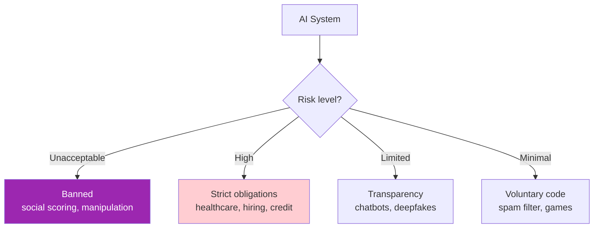
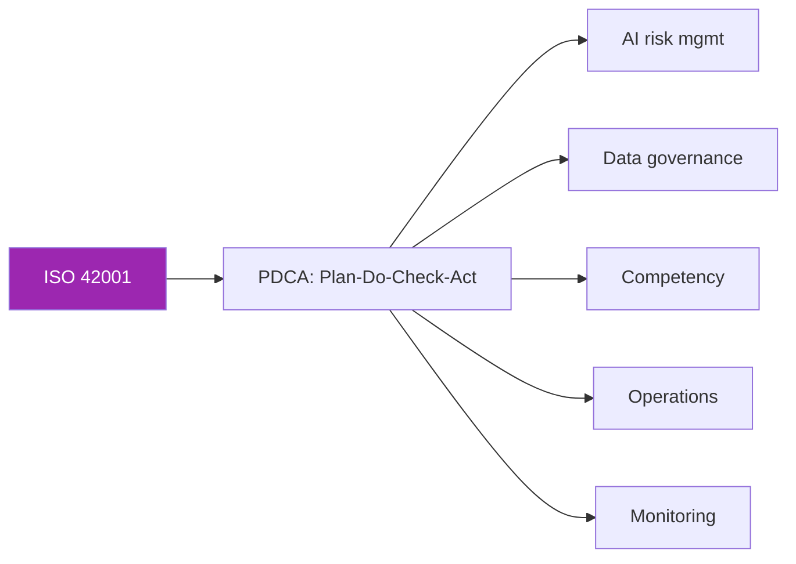

# Day 99: EU AI Act + ISO 42001 🇪🇺

<div class="lesson-meta">
⏱️ 3 ชั่วโมง &nbsp;|&nbsp; 📊 Governance &nbsp;|&nbsp; 📋 Prerequisites: Day 98
</div>

## 🎯 Learning Objectives

<ul class="objectives">
<li>เข้าใจ EU AI Act risk tiers</li>
<li>Classify your use case</li>
<li>เห็น overlap กับ ISO 42001</li>
<li>Preparedness checklist</li>
</ul>

---

## 1. EU AI Act Risk Tiers



---

## 2. Unacceptable (Prohibited)

ห้ามทำใน EU:
- Social scoring (government)
- Manipulative AI (subliminal)
- Exploiting vulnerabilities
- Real-time biometric identification in public (exceptions narrow)
- Predictive policing (purely AI-based)
- Emotion recognition at work/school
- Untargeted face image scraping

→ Don't ship these to EU users — period

---

## 3. High-Risk Systems

ตัวอย่าง:
- Recruitment / hiring
- Education admissions / grading
- Credit scoring
- Critical infrastructure
- Law enforcement evidence
- Migration / border control
- Medical devices
- Insurance underwriting

### Obligations

1. **Risk management system** (continuous)
2. **Data governance** — quality, representativeness
3. **Technical documentation** — model card+
4. **Record keeping** — logs of operation
5. **Transparency** — users know it's AI
6. **Human oversight** — humans can intervene
7. **Accuracy, robustness, cybersecurity**
8. **Conformity assessment** — before market
9. **CE marking** + EU registration
10. **Post-market monitoring**
11. **Reporting serious incidents** within 15 days

---

## 4. Limited Risk (Transparency)

- Chatbots: tell user "you're talking to AI"
- Deepfakes: label as AI-generated
- Emotion / biometric categorization: inform user

```python
# Example: clear AI disclosure
SYSTEM_PROMPT = """Always begin first response with:
"Hi! I'm an AI assistant. I'll help you with..."

If user asks 'are you human', respond clearly: 'No, I'm an AI.'"""
```

---

## 5. General-Purpose AI (GPAI) — like Claude

Special rules for foundation models (added 2024):

GPAI providers (Anthropic, OpenAI, etc.):
- Technical documentation
- Training data summary
- Copyright respect
- Computational use disclosure (if "systemic risk")

**Downstream deployers** (you, using Claude):
- Document fine-tuning / customization
- Use case risk classification
- Continue obligations of risk tier

---

## 6. Timeline & Penalties

```
2024: Act published
2025: prohibited practices effective
2026: GPAI obligations effective
2027: high-risk obligations effective
```

Penalties:
- Prohibited use: up to €35M or 7% global revenue
- High-risk non-compliance: up to €15M or 3%
- Misleading info: up to €7.5M or 1%

---

## 7. ISO 42001 — AI Management System

Published 2023. Voluntary certifiable standard.



### Structure (similar to ISO 27001)

- Context of organization
- Leadership commitment
- Planning (risks + opportunities)
- Support (resources, competence, awareness)
- Operation (controls)
- Performance evaluation
- Improvement

→ Certifiable via accredited auditors

---

## 8. Mapping: NIST RMF ↔ ISO 42001 ↔ EU AI Act

| NIST | ISO 42001 | EU AI Act |
|------|-----------|-----------|
| GOVERN | Clauses 5-7 (leadership, planning, support) | Risk management system requirement |
| MAP | Risk assessment | Use case classification |
| MEASURE | Performance evaluation | Accuracy, robustness, monitoring |
| MANAGE | Improvement, incidents | Post-market monitoring + reporting |

→ Build ONE program → checkboxes for all frameworks

---

## 9. Practical Preparedness Checklist

```markdown
# AI Compliance Preparedness — Quick Check

## EU AI Act
- [ ] Classified each use case to risk tier
- [ ] No prohibited use cases
- [ ] High-risk systems: technical documentation complete
- [ ] Transparency notices in chat UIs
- [ ] Logging + audit trail of decisions
- [ ] Human oversight workflow documented
- [ ] Incident reporting procedure (15-day SLA)

## ISO 42001 (if pursuing certification)
- [ ] AI policy approved by leadership
- [ ] AI risk assessment per use case
- [ ] Competence requirements + training records
- [ ] Internal audit program
- [ ] Management review cycle

## Documentation
- [ ] Model cards (per use case)
- [ ] Data sheets (per KB)
- [ ] Risk register (live)
- [ ] Incident log
- [ ] Audit log of model deploys
- [ ] Training records
```

---

## 10. SaaS Vendors — Customer Demands

Enterprise customers in EU จะถาม:
- Are you EU AI Act compliant? (yes, for which tier?)
- ISO 42001 certified? (or roadmap?)
- DPA includes AI clauses?
- Sub-processor list (e.g., Anthropic, AWS)
- Data residency in EU?
- Right to AI-output explanation?

```markdown
# Vendor AI Compliance Statement (template)

## Frameworks
We align with:
- EU AI Act (Limited Risk tier for X, High Risk N/A)
- NIST AI RMF
- ISO 42001 (in scope for 2026 certification)

## Subprocessors
- Anthropic (LLM provider)
- AWS (infrastructure, Bedrock for LLM hosting)

## Data
- EU customer data processed in eu-west-1 only
- DPA available on request

## Documentation
- Model card available
- Risk register: customer-facing summary available
```

---

## 🛠️ Hands-on Exercise

!!! example "Exercise 1: Classify Your Use Cases"
    For 5 hypothetical AI use cases (e.g., hiring screen, code assist, medical diagnosis, email categorizer, fraud alert) — assign EU AI Act tier + reasoning

!!! example "Exercise 2: NIST↔ISO mapping"
    Map your existing NIST docs to ISO 42001 clauses — gap analysis

!!! example "Exercise 3: Compliance Statement"
    Write vendor compliance statement for your project (Day 82-90)

---

## ✅ Self-Check Quiz

<div class="quiz">

**Q1:** EU AI Act ใช้บังคับใคร?

??? success "ดูคำตอบ"
    - AI systems placed on EU market (regardless of where built)
    - EU users / affected EU individuals
    - Importers, distributors, deployers — ทุก roles ของ supply chain

**Q2:** NIST RMF vs ISO 42001?

??? success "ดูคำตอบ"
    - NIST: voluntary framework, US-origin, flexible playbook
    - ISO 42001: certifiable management system standard, more prescriptive
    - Both compatible — use NIST as guide, ISO for certification

</div>

---

## 🔍 Cross-check & References

- 📘 [EU AI Act (consolidated)](https://artificialintelligenceact.eu/)
- 📘 [ISO/IEC 42001](https://www.iso.org/standard/81230.html)
- 📘 [NIST AI RMF crosswalk](https://www.nist.gov/itl/ai-risk-management-framework)

[ต่อไป → Day 100: PDPA + GDPR :material-arrow-right:](day-100.md){ .md-button .md-button--primary }
