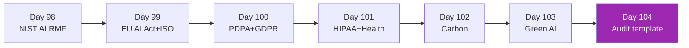

# Week 14: Compliance & Governance ⚖️

ทำให้ AI deployment ผ่าน enterprise audit + regulatory scrutiny

| Day | หัวข้อ | เวลา |
|-----|--------|------|
| 98 | NIST AI RMF | 3h |
| 99 | EU AI Act + ISO 42001 | 3h |
| 100 | PDPA Thailand + GDPR for AI | 3h |
| 101 | HIPAA + sector-specific regs | 3h |
| 102 | Carbon footprint of AI | 3h |
| 103 | Green AI patterns | 3h |
| 104 | Compliance audit template | 3h |

[เริ่ม Day 98 :material-arrow-right:](day-98.md){ .md-button .md-button--primary }
