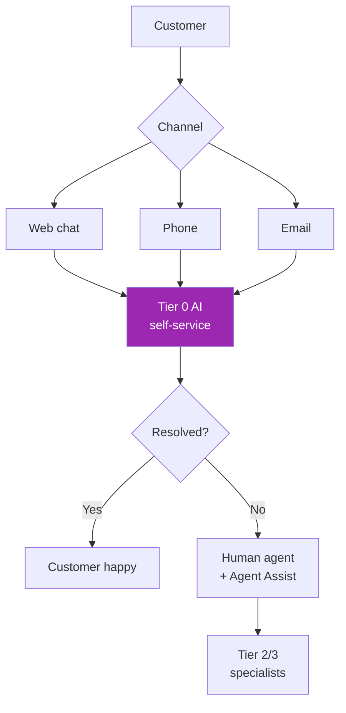
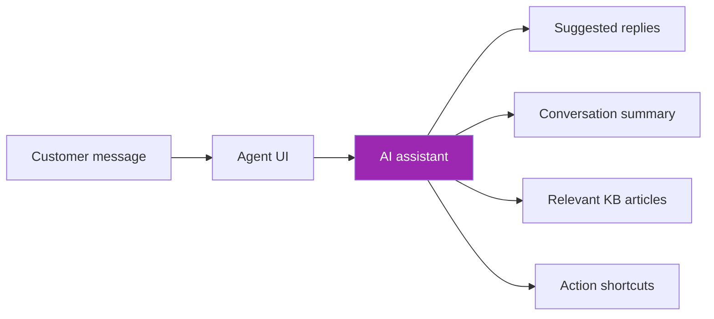
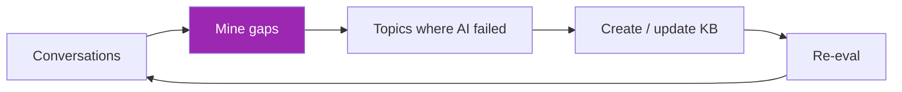

# Day 105: Customer Support AI 🎧

<div class="lesson-meta">
⏱️ 3 ชั่วโมง &nbsp;|&nbsp; 📊 Vertical &nbsp;|&nbsp; 📋 Prerequisites: Months 1-3
</div>

## 🎯 Learning Objectives

<ul class="objectives">
<li>Design 3-tier support AI</li>
<li>Build agent-assist for human agents</li>
<li>เห็น metrics ที่สำคัญ (CSAT, AHT, deflection)</li>
</ul>

---

## 1. Customer Support AI Architecture



3 layers:
- **Tier 0 AI**: deflect simple Qs (FAQ, status, returns)
- **Agent Assist**: help human agents (suggest reply, summarize)
- **Insight Layer**: trends, root cause, coaching

---

## 2. Tier 0 AI — Direct Customer

### Scope (what AI handles)
✅ FAQ ("hours? return policy?")
✅ Order status lookup
✅ Account info (after auth)
✅ Simple returns / cancellations
✅ Routing ("who handles X?")

❌ Out of scope
- Complex disputes
- Compensation decisions
- Medical / legal advice
- Vulnerable customers (auto-escalate)

### Tools

```python
TOOLS = [
    {"name": "lookup_order", "input_schema": {...}},
    {"name": "lookup_account", "input_schema": {...}},
    {"name": "initiate_return", "input_schema": {...}},
    {"name": "check_warranty", "input_schema": {...}},
    {"name": "escalate_to_agent", "input_schema": {...}},
]
```

→ Each tool requires auth + has rate limit + audit log

---

## 3. Escalation Triggers

```python
def should_escalate(state):
    # Explicit request
    if "speak to human" in state.last_message.lower():
        return True
    
    # Sentiment
    if state.sentiment_score < -0.5:
        return True
    
    # Stuck (3+ turns without progress)
    if state.unresolved_turns >= 3:
        return True
    
    # High-value account
    if state.user.tier == "enterprise":
        return True
    
    # Risk keywords
    risk_words = ["lawyer", "lawsuit", "complaint", "fraud", "stolen"]
    if any(w in state.last_message.lower() for w in risk_words):
        return True
    
    # Vulnerable customer indicators
    if state.user.flags.get("vulnerable"):
        return True
    
    return False
```

---

## 4. Agent Assist — Help Humans



```python
def agent_assist_panel(conversation):
    # 1. Summary (for context if agent just joined)
    summary = claude.messages.create(
        model="claude-haiku-4-5-20251001",
        system="Summarize conversation in 2-3 sentences. Highlight the issue + tried solutions.",
        messages=[{"role": "user", "content": str(conversation)}]
    )
    
    # 2. Suggested replies (3 options)
    suggestions = claude.messages.create(
        model="claude-sonnet-4-6",
        system="Suggest 3 polite, concise reply options for the agent. Format as JSON list.",
        messages=[{"role": "user", "content": str(conversation)}]
    )
    
    # 3. Relevant KB
    last_msg = conversation[-1]["content"]
    kb_results = retriever.retrieve(last_msg, top_k=3)
    
    return {
        "summary": summary.content[0].text,
        "suggestions": json.loads(suggestions.content[0].text),
        "kb_articles": kb_results
    }
```

Agent picks > edits > sends. Speed up + consistency.

---

## 5. Voice Support

```python
# LiveKit + SIP for inbound calls
# Day 91-93 stack

VOICE_SYSTEM = """You're a friendly support agent. 
- Confirm caller intent first
- Verify identity for account questions (DOB, email)
- Be brief — voice format
- Offer to transfer to human anytime
- For complex/escalating: transfer immediately
"""

# Tool: transfer_to_human (SIP transfer)
@llm.ai_callable(description="Transfer call to human agent queue")
async def transfer_to_human(reason: str):
    await assistant.say(f"I'll connect you with a colleague who can help. One moment.")
    await transfer_call_via_sip(human_queue_uri, context={"summary": ..., "reason": reason})
```

---

## 6. Metrics That Matter

```python
SUPPORT_KPIS = {
    # Volume
    "tickets_per_day": "trend",
    "ai_handled_pct": "≥ 50% (mature)",
    
    # Quality
    "csat_score": "≥ 4.5/5",
    "first_contact_resolution": "≥ 70%",
    "ai_escalation_rate": "≤ 25%",
    
    # Efficiency  
    "avg_handle_time": "trending down with AI",
    "after_call_work": "trending down (auto-summarize)",
    
    # Customer
    "deflection_rate": "% resolved without human",
    "repeat_contact_rate": "should not increase due to AI",
}
```

---

## 7. KB Curation Loop



```python
def find_kb_gaps():
    # Conversations where AI escalated
    escalations = get_escalations(last_n_days=7)
    
    # Cluster by topic
    embeddings = [embed(e.first_message) for e in escalations]
    clusters = cluster(embeddings, n=20)
    
    gaps = []
    for cluster_msgs in clusters:
        # Use Claude to identify if topic deserves KB article
        analysis = claude_analyze_cluster(cluster_msgs)
        if analysis["should_have_kb_article"]:
            gaps.append({
                "topic": analysis["topic"],
                "count": len(cluster_msgs),
                "sample_questions": cluster_msgs[:3]
            })
    
    return sorted(gaps, key=lambda g: g["count"], reverse=True)
```

→ Weekly: top 5 gaps → KB team writes articles

---

## 8. Compliance for Support

- Recording consent (Day 93)
- PII masking before LLM (Day 100)
- Retention: typical 90 days for conversation logs (varies)
- Right to delete: include conversation history
- Audit log: all AI-handled cases
- For vulnerable customers: prefer human even for simple Qs

---

## 9. Vendor Landscape

| Tool | Strength |
|------|----------|
| **Anthropic + custom (DIY)** | Most flexibility |
| Zendesk AI | Tight integration with Zendesk |
| Intercom Fin | Quick deploy on top of Intercom |
| Salesforce Service Cloud AI | If on SF stack |
| Ada | No-code low-code Tier 0 |
| Cresta | Real-time coaching focus |

→ DIY (Claude + your stack) wins for complex / differentiated experiences

---

## 10. Case Pattern: Bank Customer Support

```markdown
# Architecture
- Channel: web chat (auth required) + phone (SIP)
- Tier 0: Sonnet — handles balance, transactions, simple disputes
- Escalation: 30% to human
- Agent Assist: Haiku for suggestions, Opus for compliance check
- Backstage: Sonnet weekly KB gap report

# Compliance
- All conversations recorded with consent
- PII masked before LLM
- PCI scope: payment requests transfer to dedicated IVR
- BAA: AWS Bedrock + Anthropic
- Audit: 7-year retention per regulation

# Metrics (illustrative goals — measure your own)
- Deflection: 50-65% of inquiries
- CSAT: stable or improving
- Avg handle time: reduced
- Cost/contact: significantly lower for deflected
```

---

## 🛠️ Hands-on Exercise

!!! example "Exercise 1: Tool Suite"
    Design 5 support tools with schemas + escalation conditions

!!! example "Exercise 2: Agent Assist"
    Build agent-assist panel (summary + 3 suggestions + KB)

!!! example "Exercise 3: KB Gap Mining"
    Run gap analysis on sample conversations + identify top 3 gaps

---

## ✅ Self-Check Quiz

<div class="quiz">

**Q1:** ทำไม Agent Assist ปลอดภัยกว่า Tier 0 AI?

??? success "ดูคำตอบ"
    Human agent reviews AI suggestion before sending → catches errors, judgment calls. Lower risk per interaction. Good entry point if Tier 0 risk too high.

**Q2:** Escalation rate ควรอยู่เท่าไหร่?

??? success "ดูคำตอบ"
    Varies by domain. Too low (< 5%) = AI may be hallucinating answers it can't really resolve. Too high (> 40%) = AI not earning its keep. Target: domain-dependent — measure and tune.

</div>

---

## 🔍 Cross-check & References

- 📘 [Anthropic — Building Customer-Facing Agents](https://www.anthropic.com/research)
- 📺 [Customer Support AI patterns](https://www.deeplearning.ai/short-courses/)

[ต่อไป → Day 106: Coding Agents :material-arrow-right:](day-106.md){ .md-button .md-button--primary }
