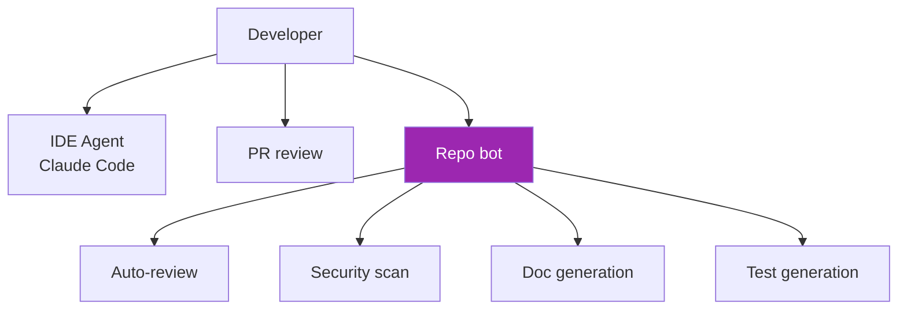
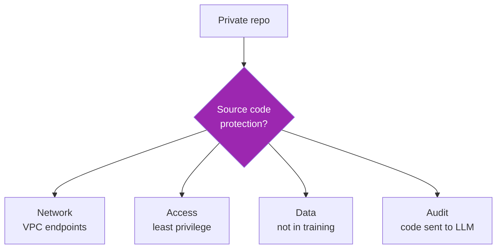

# Day 106: Enterprise Coding Agents 💻

<div class="lesson-meta">
⏱️ 3 ชั่วโมง &nbsp;|&nbsp; 📊 Vertical &nbsp;|&nbsp; 📋 Prerequisites: Day 22, 26
</div>

## 🎯 Learning Objectives

<ul class="objectives">
<li>เห็น enterprise patterns สำหรับ coding agents</li>
<li>Build PR review bot</li>
<li>Auto-doc + auto-test patterns</li>
<li>Security review + IP protection</li>
</ul>

---

## 1. Enterprise Coding Agent Landscape



---

## 2. Patterns vs Public Tools

| Need | Public tool | Why custom? |
|------|------------|-------------|
| Code completion | Copilot, Codeium | Use public for most |
| Repo Q&A | Cursor, Claude Code | Use public |
| PR review | + GitHub Copilot | Customize for your standards |
| Internal API knowledge | — | **Custom needed** |
| Compliance/security review | — | **Custom needed** |
| Architecture-aware refactor | — | **Custom needed** |

→ Custom = company-specific knowledge + standards

---

## 3. PR Review Bot Architecture

```python
# .github/workflows/ai-review.yml
on:
  pull_request:
    types: [opened, synchronize]

jobs:
  ai-review:
    runs-on: ubuntu-latest
    steps:
      - uses: actions/checkout@v4
        with:
          fetch-depth: 0
      
      - name: AI Review
        run: python scripts/pr_review.py
        env:
          GITHUB_TOKEN: ${{ secrets.GITHUB_TOKEN }}
          ANTHROPIC_API_KEY: ${{ secrets.ANTHROPIC_API_KEY }}
          PR_NUMBER: ${{ github.event.number }}
```

```python
# scripts/pr_review.py
from anthropic import Anthropic
from github import Github
import subprocess

client = Anthropic()
gh = Github(GITHUB_TOKEN)
repo = gh.get_repo(REPO)
pr = repo.get_pull(PR_NUMBER)

# Get diff
diff = subprocess.check_output(["git", "diff", "main..HEAD"]).decode()

# Get changed files content for context
changed_files = [f.filename for f in pr.get_files()]
context = {f: open(f).read() for f in changed_files if os.path.exists(f)}

SYSTEM = """You're a senior engineer reviewing a PR for <Company>.

Review criteria:
1. Correctness — bugs, edge cases
2. Style — follows our [style guide URL]
3. Security — OWASP top 10, secrets, injection
4. Performance — obvious issues
5. Tests — adequate coverage
6. Architecture — fits ADR-001..N

Output JSON:
{
  "summary": "2-line overall",
  "score": 0-10,
  "comments": [
    {"file": "...", "line": N, "severity": "info|nit|suggest|require", "comment": "..."}
  ],
  "blocking": ["...","..."]  // must fix
}
"""

resp = client.messages.create(
    model="claude-sonnet-4-6",
    max_tokens=4000,
    system=SYSTEM,
    messages=[{
        "role": "user",
        "content": f"PR title: {pr.title}\nDescription: {pr.body}\n\nDiff:\n{diff}\n\nContext files: {json.dumps(context)[:50000]}"
    }]
)

review = json.loads(resp.content[0].text)

# Post review
for comment in review["comments"]:
    pr.create_review_comment(
        body=f"[AI {comment['severity']}] {comment['comment']}",
        commit=pr.head.sha,
        path=comment["file"],
        line=comment["line"]
    )

if review["blocking"]:
    pr.create_review(body="\n".join(review["blocking"]), event="REQUEST_CHANGES")
else:
    pr.create_issue_comment(f"### AI Review\n\n{review['summary']}\n\nScore: {review['score']}/10")
```

---

## 4. Security Scan Pattern

```python
SECURITY_SYSTEM = """Scan this code for security issues:

1. Hardcoded secrets (API keys, passwords)
2. SQL injection (string concat queries)
3. Command injection (shell=True, eval)
4. Path traversal (../, user-controlled paths)
5. SSRF (user-controlled URLs)
6. XSS (unescaped output to HTML)
7. Insecure deserialization (pickle, yaml.load)
8. Weak crypto (MD5, SHA1, ECB)
9. Missing auth/authz checks
10. Race conditions / TOCTOU

For each finding:
{
  "type": "...",
  "severity": "critical|high|medium|low",
  "file": "...",
  "line": N,
  "description": "...",
  "fix_suggestion": "..."
}

Be precise. Don't flag patterns that have been mitigated. If unsure, mark as "possible" with low severity.
"""

def security_scan(file_path):
    code = open(file_path).read()
    resp = client.messages.create(
        model="claude-opus-4-7",  # use Opus for security — quality > cost
        max_tokens=3000,
        system=SECURITY_SYSTEM,
        messages=[{"role": "user", "content": f"File: {file_path}\n\n{code}"}]
    )
    return json.loads(resp.content[0].text)
```

Combine with static analyzers (Semgrep, CodeQL) — Claude provides context-aware judgment, SAST provides recall.

---

## 5. Auto-Documentation

```python
DOC_SYSTEM = """Document this code following our style:

Function/Class:
- Purpose: 1-2 sentences
- Parameters: type + meaning + constraints
- Returns: type + meaning  
- Raises: exceptions + when
- Example: 1 realistic usage
- Notes: caveats, complexity

Match existing docstrings style in the file.
"""

def add_docstrings(file_path):
    code = open(file_path).read()
    
    # Find undocumented functions/classes
    undocumented = find_undocumented(code)  # using AST
    
    for sym in undocumented:
        new_doc = client.messages.create(
            model="claude-sonnet-4-6",
            max_tokens=500,
            system=DOC_SYSTEM,
            messages=[{"role": "user", "content": f"Document this:\n{sym.code}"}]
        )
        
        # Insert via AST manipulation
        code = insert_docstring(code, sym.name, new_doc.content[0].text)
    
    return code
```

---

## 6. Test Generation

```python
TEST_SYSTEM = """Generate pytest tests for this function.

Cover:
- Happy path (2-3 cases)
- Edge cases (empty, None, boundary)
- Error conditions
- Important branches

Use:
- Parametrize for variations
- Fixtures for setup
- Mocks for I/O

Match testing style in repo (check existing tests).
Output only the test code, no explanation.
"""

def gen_tests(function_code, existing_tests_sample):
    resp = client.messages.create(
        model="claude-sonnet-4-6",
        max_tokens=2000,
        system=TEST_SYSTEM,
        messages=[{"role": "user", "content": f"Existing test style:\n{existing_tests_sample}\n\nFunction:\n{function_code}\n\nGenerate tests:"}]
    )
    return resp.content[0].text
```

⚠️ Always run generated tests + verify they actually test the function (no `assert True`)

---

## 7. IP & Security Protections



Best practices:
- **Self-hosted runners** for sensitive repos
- **Bedrock PT or Direct API** with no-training contracts
- **VPC endpoints** — no public internet
- **Selective context** — send relevant files only
- **PII / secret pre-filter** before sending
- **Audit log** of what was sent

Check Anthropic / cloud provider policies:
- Anthropic API: no training on Direct API data
- Bedrock: customer data not used for training
- Always verify in current ToS / DPA

---

## 8. Cost Control

Coding agents are token-heavy (large context):

```python
# Lever 1: Smart file selection
def relevant_files(query, repo_path):
    # Use grep / semantic search first
    candidates = find_likely_relevant(query, repo_path)
    return candidates[:10]  # not all 1000 files

# Lever 2: Summary cache  
@cache.cached()
def file_summary(path):
    content = open(path).read()
    return haiku_summarize(content)

# Lever 3: Tiered model
def review_code(diff):
    # Pre-screen with Haiku
    triage = haiku_classify(diff)  # "trivial / standard / complex"
    
    if triage == "trivial":
        return None  # skip review
    elif triage == "standard":
        return sonnet_review(diff)
    else:
        return opus_review(diff)
```

---

## 9. Anti-Patterns

❌ Auto-merge based on AI score
❌ Bypass human review for security-critical code
❌ Use AI tests as sole quality gate
❌ Generate code without humans understanding it
❌ Send entire monorepo as context
❌ Skip license/IP review of AI-suggested patterns
❌ Train on customer code without consent

---

## 10. Vendor Landscape

| Tool | Strength |
|------|----------|
| **Claude Code (Anthropic)** | Best Claude integration |
| GitHub Copilot | Ubiquitous IDE |
| Cursor | Strong IDE UX |
| Cody (Sourcegraph) | Enterprise repo context |
| Codeium / Tabnine | Self-host options |
| Aider | Open-source CLI agent |

→ Combine: IDE tool for completion + custom Claude bots for review/audit specific to your org

---

## 🛠️ Hands-on Exercise

!!! example "Exercise 1: PR Review"
    Wire up PR review bot in test repo → review 3 PRs

!!! example "Exercise 2: Security Scan"
    Build security scan + run on intentionally-vulnerable code (DVPWA-style)

!!! example "Exercise 3: Test Gen"
    Generate tests for 5 functions → verify they catch bugs

---

## ✅ Self-Check Quiz

<div class="quiz">

**Q1:** ทำไม security scan ใช้ Opus?

??? success "ดูคำตอบ"
    Security false negatives expensive — better to spend on stronger model. False positives manageable (engineers review). Frequency low (per PR, not per request).

**Q2:** Self-hosted vs Cloud API for sensitive code?

??? success "ดูคำตอบ"
    Cloud (Bedrock/Anthropic) typically OK with proper contracts (no training) + VPC endpoints. Self-hosted (Llama / similar) for highest control but quality gap. Most enterprises use cloud Claude with NDA-level contracts.

</div>

---

## 🔍 Cross-check & References

- 📘 [Claude Code](https://docs.claude.com/en/docs/claude-code)
- 📦 [Aider](https://aider.chat/)
- 📺 [Building AI Coding Agents (Anthropic)](https://www.anthropic.com/research)

[ต่อไป → Day 107: Legal AI :material-arrow-right:](day-107.md){ .md-button .md-button--primary }
