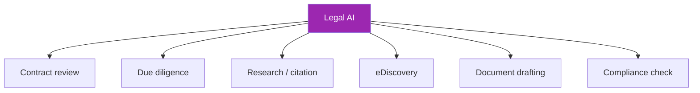

# Day 107: Legal AI ⚖️

<div class="lesson-meta">
⏱️ 3 ชั่วโมง &nbsp;|&nbsp; 📊 Vertical &nbsp;|&nbsp; 📋 Prerequisites: Week 13-14
</div>

## 🎯 Learning Objectives

<ul class="objectives">
<li>Design legal AI with human-in-loop</li>
<li>Build contract review automation</li>
<li>Handle citations + provenance</li>
</ul>

---

## 1. Legal AI Landscape



**Common thread**: high-stakes, citation-critical, must keep lawyer in loop

---

## 2. Risk Tier Classification

| Use case | Risk | Mitigation |
|---------|------|-----------|
| First-pass contract review | Medium | Human signs off; AI not authoritative |
| Drafting standard NDA | Medium | Templates + human review |
| Legal advice to public | **Unauthorized practice** | Don't — refer to lawyer |
| Citation lookup | Low-Med | Verify citations exist |
| Privilege review (eDiscovery) | High | Sample + lawyer audit |
| Litigation strategy | High | AI for ideation only |

⚠️ **Never claim AI provides legal advice** — disclaimers + lawyer review for any decision

---

## 3. Contract Review Pattern

```python
CONTRACT_SYSTEM = """You are a contract analysis assistant. You are NOT a lawyer.

Review this contract and identify:

1. Standard clauses (note presence/absence)
   - Indemnification
   - Limitation of liability
   - Termination
   - Confidentiality
   - IP ownership
   - Governing law
   - Dispute resolution

2. Risk flags (compared to typical positions):
   - Asymmetric (favors counterparty)
   - Unusual / non-standard
   - Missing protections

3. Specific data points to extract:
   - Parties (with full names)
   - Effective date
   - Term length
   - Auto-renewal terms
   - Payment terms
   - Termination notice period

Output JSON. Include exact quote + clause number for each finding.
DO NOT provide legal opinions. DO NOT advise on enforceability.
"""

class ContractReview(BaseModel):
    parties: list[str]
    effective_date: Optional[str]
    term_length: Optional[str]
    auto_renewal: Optional[bool]
    standard_clauses_present: dict[str, bool]
    risk_flags: list[dict]
    extracted_dates: dict
```

---

## 4. Citation & Provenance

Critical: every claim ↔ exact source location

```python
def analyze_with_citations(contract_text):
    # Number paragraphs for citation
    paragraphs = split_into_paragraphs(contract_text)
    numbered = "\n\n".join([f"[¶{i+1}] {p}" for i, p in enumerate(paragraphs)])
    
    resp = client.messages.create(
        model="claude-opus-4-7",
        max_tokens=4000,
        system=CONTRACT_SYSTEM + "\n\nFor every finding, cite the paragraph [¶N].",
        messages=[{"role": "user", "content": numbered}]
    )
    
    findings = json.loads(resp.content[0].text)
    
    # Verify citations point to real paragraphs
    for f in findings["risk_flags"]:
        para_nums = re.findall(r"¶(\d+)", f["citation"])
        for n in para_nums:
            if int(n) > len(paragraphs):
                f["citation_error"] = True
    
    return findings, paragraphs
```

---

## 5. Hallucinated Citation Detection

Notorious problem: AI invents case citations that don't exist

```python
def verify_case_citations(text):
    """Extract case citations and verify they exist"""
    pattern = r"([\w\s.]+?\s+v\.\s+[\w\s.]+?),?\s+(\d+)\s+([A-Z][\w.]+)\s+(\d+)"
    citations = re.findall(pattern, text)
    
    verified = []
    for case_name, vol, reporter, page in citations:
        # Lookup via legal database API
        exists = lookup_in_westlaw_or_courtlistener(case_name, vol, reporter, page)
        verified.append({
            "citation": f"{case_name}, {vol} {reporter} {page}",
            "exists": exists
        })
    
    return verified
```

→ Use CourtListener (free) or Westlaw/Lexis (paid) — never trust AI's case cite without verification

---

## 6. Redlining Pattern

```python
REDLINE_SYSTEM = """Compare this contract clause against our standard playbook clause.

Standard:
{standard_clause}

Proposed:
{proposed_clause}

Output:
- material_differences: list of substantive changes
- redline: track-changes-style diff (in JSON: additions, deletions)
- assessment: which version is more favorable to us, why
- suggested_counter: alternative if proposed unacceptable
"""

def redline_clause(standard, proposed):
    resp = client.messages.create(
        model="claude-opus-4-7",
        max_tokens=2000,
        messages=[{"role": "user", "content": REDLINE_SYSTEM.format(...)}]
    )
    return resp.content[0].text
```

---

## 7. eDiscovery — Document Relevance

```python
ED_PROMPT = """Classify this document for legal discovery.

Case: {case_summary}
Document: {doc_content}

Categories:
- RELEVANT — pertains to case issues
- POTENTIALLY_RELEVANT — borderline
- NOT_RELEVANT — clearly outside scope
- PRIVILEGED — attorney-client / work product (escalate)
- PII — contains personal info needing redaction

Output JSON with: category, confidence (0-1), reasoning, key_topics
"""

def review_corpus(docs, case_summary):
    results = []
    for d in docs:
        # Pre-filter with embedding similarity to case topics
        if embedding_relevance(d, case_summary) < 0.3:
            results.append({"doc": d.id, "category": "NOT_RELEVANT", "method": "embedding"})
            continue
        
        # LLM classification for closer cases
        result = claude_classify(d, case_summary)
        results.append({"doc": d.id, **result, "method": "llm"})
    
    return results
```

**Privilege detection** — extra careful, always lawyer reviews flagged items

---

## 8. Drafting Assistant

```python
DRAFT_SYSTEM = """Help draft a {document_type}.

Use our playbook clauses where applicable.
For non-standard items, draft conservatively (favor protective language).

Parameters:
{parameters}

Output:
- draft_text (full document)
- explanations (per section, why this language)
- alternatives (where multiple acceptable approaches exist)
- review_needed (sections requiring lawyer judgment)

DO NOT include legal opinions on enforceability.
"""
```

→ Lawyer reviews + may rewrite; AI saves time on plumbing

---

## 9. Compliance Considerations

```markdown
## Legal AI Disclaimers (every UI)
"This AI assistant provides drafting and analysis support.
It does NOT provide legal advice. Output must be reviewed by qualified counsel.
Do not rely on this output for binding legal decisions."

## Data Handling
- Privileged content tagged + access controlled
- Conflict checks before document analysis
- Retention per legal hold rules
- Audit log: who accessed what document when

## Subprocessor Disclosure
- Anthropic / Bedrock / Cohere disclosed
- Client matter codes for billing tied to LLM cost
```

---

## 10. Vendor Landscape

| Tool | Strength |
|------|----------|
| **DIY Claude + RAG** | Customization for firm playbook |
| Harvey | Legal-specific, end-to-end |
| Spellbook (CLIO) | Contract drafting in Word |
| Lexis+ AI | Lexis integration |
| Thomson Reuters CoCounsel | Westlaw integration |
| Casetext / vLex | Research focus |
| Ironclad AI | Contract lifecycle |

→ DIY wins for firm-specific playbook; vertical tools faster to deploy

---

## 🛠️ Hands-on Exercise

!!! example "Exercise 1: Contract Reviewer"
    Build reviewer that extracts 6 standard clauses + flags risks → run on 3 sample NDAs

!!! example "Exercise 2: Citation Verifier"
    Build case citation extractor + verifier (CourtListener API)

!!! example "Exercise 3: Disclaimer Audit"
    Audit your interfaces — disclaimers present where required?

---

## ✅ Self-Check Quiz

<div class="quiz">

**Q1:** ทำไม legal AI ต้องเก็บ paragraph-level citations?

??? success "ดูคำตอบ"
    - Lawyer must verify exact source quickly
    - Reduces hallucination risk
    - Required for due diligence audit trails
    - Court-admissible reasoning chain

**Q2:** "Unauthorized practice of law" — ทำไมเป็นความเสี่ยง?

??? success "ดูคำตอบ"
    - Most jurisdictions restrict legal advice to licensed attorneys
    - AI assistant ≠ lawyer
    - Disclaimers + lawyer review protect both user and provider
    - Some jurisdictions consider AI advice direct UPL violation

</div>

---

## 🔍 Cross-check & References

- 📘 [Stanford CodeX (legal AI research)](https://law.stanford.edu/codex-the-stanford-center-for-legal-informatics/)
- 📦 [CourtListener API (free case lookup)](https://www.courtlistener.com/help/api/)
- 📺 [Anthropic — legal use cases](https://www.anthropic.com/customers)

[ต่อไป → Day 108: Financial Services :material-arrow-right:](day-108.md){ .md-button .md-button--primary }
