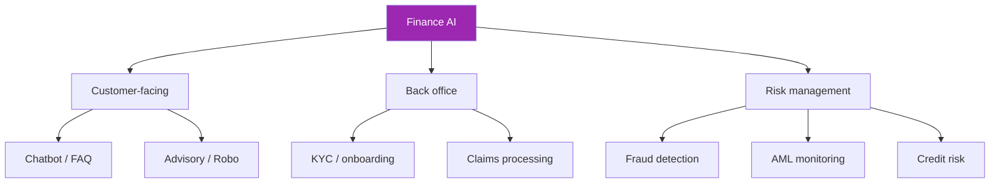
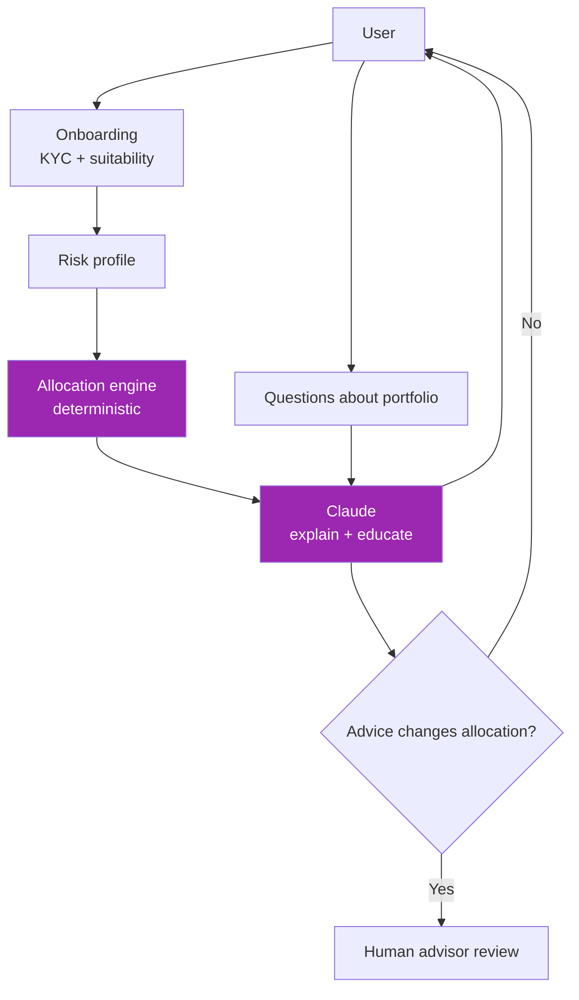

# Day 108: Financial Services AI 💰

<div class="lesson-meta">
⏱️ 3 ชั่วโมง &nbsp;|&nbsp; 📊 Vertical &nbsp;|&nbsp; 📋 Prerequisites: Week 14
</div>

## 🎯 Learning Objectives

<ul class="objectives">
<li>เห็น patterns ใน finance AI</li>
<li>Build AML / fraud screening</li>
<li>Advisory AI with suitability checks</li>
</ul>

---

## 1. Finance AI Use Cases



---

## 2. Regulatory Foundation

| Reg | What | AI impact |
|-----|------|-----------|
| **PCI DSS** | Payment card data | Scope minimization (Day 101) |
| **SOX** | Public company financials | Audit trail of AI decisions |
| **ECOA / Fair Lending** | No discrimination | Bias testing required |
| **GLBA (US)** | Customer privacy | Data handling controls |
| **AML/BSA** | Money laundering | Explainability for SAR |
| **Suitability (FINRA)** | Investment advice | Client suitability check |
| **Adverse Action** | Loan denial reasons | Specific reasons (not "AI said no") |

---

## 3. Fraud Detection Pattern

```python
FRAUD_SYSTEM = """Analyze this transaction for fraud signals.

Transaction:
{tx_json}

Customer history (last 30 days):
{history}

Output JSON:
{
  "risk_score": 0-100,
  "signals": [
    {"type": "...", "weight": 0-10, "evidence": "..."}
  ],
  "recommendation": "approve|review|decline|block",
  "reasoning": "plain English"
}

Common fraud signals:
- Velocity (many transactions short time)
- Geographic mismatch
- Amount outlier vs history
- Merchant category unusual
- New device / location
- Sequential amounts (testing card)
"""

def screen_transaction(tx, customer_history):
    # Hybrid: rules + ML score + LLM context
    rules_score = rule_engine(tx, customer_history)
    ml_score = ml_model.predict(tx, customer_history)
    
    # LLM for explanation + edge cases
    if 30 < ml_score < 70:  # ambiguous zone
        llm_review = claude_review(tx, customer_history)
        final = combine(rules_score, ml_score, llm_review)
    else:
        final = ml_score
    
    return final
```

⚠️ ML model is primary; LLM adds explanation + handles edge cases. Don't replace deterministic rules with LLM.

---

## 4. AML Monitoring

```python
AML_PROMPT = """Review this account's transactions for AML red flags.

Transactions ({n}):
{tx_summary}

Look for:
- Structuring (just below reporting threshold)
- Layering (rapid in-out)
- Unusual cross-border patterns
- High-risk jurisdictions
- Mismatched economic profile

For each flag:
- pattern_type
- evidence (specific transactions)
- regulator_concern (which AML rule)
- recommended_action (file SAR / further investigate / clear)
"""

# Output → human investigator → SAR (Suspicious Activity Report) if warranted
# Critical: SAR is regulator-facing, must be defensible
```

**Explainability mandatory**: regulator asks "why did you file/not file" → AI reasoning preserved

---

## 5. Investment Advisory — Suitability

```python
SUITABILITY_CHECK = """Check if this recommendation is suitable for the client.

Client profile:
- Age: {age}
- Income: {income}
- Net worth: {net_worth}
- Risk tolerance: {risk_tolerance}
- Investment objectives: {objectives}
- Time horizon: {time_horizon}
- Investment experience: {experience}
- Existing holdings: {existing}

Proposed:
{recommendation}

Output JSON:
{
  "suitable": true|false,
  "reasoning": "...",
  "concerns": ["concentration risk", "liquidity mismatch", ...],
  "required_disclosures": ["..."]
}

Reference: FINRA Rule 2111 (Suitability) and Reg BI (Regulation Best Interest)
"""
```

→ Robo-advisor / advisor-assist must run suitability check + log it

---

## 6. Credit Decision — Fairness

```python
# Fair lending — protected attributes monitoring
PROTECTED = ["race", "color", "religion", "national_origin", "sex", "marital_status", "age"]

def credit_decision(applicant_data, protected_excluded):
    # Make decision WITHOUT protected attributes
    safe_data = {k: v for k, v in applicant_data.items() if k not in PROTECTED}
    
    decision = ml_model.predict(safe_data)
    
    # Adverse action requires specific reasons
    if decision == "deny":
        reasons = explain_denial(safe_data, decision)  # SHAP / LIME / counterfactual
        # NOT "AI said no" — specific factors like: 
        #   "Income to debt ratio below threshold"
        #   "Length of credit history insufficient"
        return {"decision": "deny", "specific_reasons": reasons}
    
    return {"decision": decision}

# Periodic bias audit
def fairness_audit(decisions, protected_attrs_for_audit):
    """Test disparate impact AFTER decisions"""
    # Compare approval rates by group
    rates = group_by_protected(decisions, protected_attrs_for_audit)
    parity_diff = max(rates.values()) - min(rates.values())
    if parity_diff > 0.05:
        alert("FAIR_LENDING_DISPARITY", rates)
```

→ LLM can write adverse action notices but ML model makes decision with fairness controls

---

## 7. Robo-Advisor Architecture



→ Allocation = deterministic model; LLM explains + educates
→ Any change to allocation needs human advisor

---

## 8. AI Disclosures (Required)

```markdown
## In every interface:

"You are using an AI-assisted advisory service.
- Recommendations are generated by algorithms + AI
- This service does not replace licensed financial advisor consultation
- Past performance does not guarantee future results
- Suitability checks performed; you remain responsible for final decisions
- Service operated by [firm], registered with [regulator]
- For human advisor, click here"
```

---

## 9. Audit Trail Requirements

```python
def log_advisory_interaction(user_id, session):
    audit_log({
        "user_id": user_id,
        "session_id": session.id,
        "timestamp": now(),
        "model_version": "claude-sonnet-4-6@2026-05-01",  # pinned
        "system_prompt_version": "v3.2",
        "user_profile_snapshot": serialize(user.profile),  # at time of advice
        "input": session.transcript,
        "output": session.responses,
        "tool_calls": session.tool_calls,
        "suitability_check_result": session.suitability,
        "human_review": session.human_reviewer,  # if any
        "compliance_review": session.compliance_status
    })
```

→ Retain 5-7 years per SEC / SET requirements

---

## 10. Case Pattern: Bank Customer AI

```markdown
# Architecture
- Auth: SSO with MFA
- Tier 0: Account balance, transactions, transfers within limits
- Advisory: Read-only insights ("you're spending more on dining this month")
- Disputes: AI triage + collect info, human resolves
- Fraud alerts: AI detects + alerts customer via push, human in loop for confirmed fraud
- PCI: Payment requests transferred to PCI-compliant IVR

# Models
- Haiku for Q&A
- Sonnet for advisory explanations
- Opus rarely — reserved for complex disputes

# Compliance
- BAA chain (if PHI in some cases like life insurance)
- PCI scope minimization
- Reg BI suitability for any recommendations
- AML hooks for unusual patterns
- DPA + privacy notice

# Metrics
- Auth success rate
- Deflection rate
- Fraud catch rate (vs ground truth)
- False positive rate (customer complaints)
- Suitability check pass rate
- Adverse action notice quality (sampling)
```

---

## 🛠️ Hands-on Exercise

!!! example "Exercise 1: Fraud Hybrid"
    Build hybrid (rules + ML stub + LLM) fraud screener for 20 sample tx

!!! example "Exercise 2: Suitability Check"
    Build suitability checker for 5 client profiles × 3 product types

!!! example "Exercise 3: Adverse Action"
    Generate compliant adverse action notice from denied loan data

---

## ✅ Self-Check Quiz

<div class="quiz">

**Q1:** ทำไม fraud detection ไม่ใช้ LLM เพียวๆ?

??? success "ดูคำตอบ"
    - Volume too high (cost)
    - Latency critical (real-time decisions)
    - Determinism for audit
    - ML models trained on labeled fraud are highly tuned
    - LLM adds reasoning layer for edge cases only

**Q2:** Reg BI suitability check — ขั้นต่ำต้องมีอะไร?

??? success "ดูคำตอบ"
    - Client profile (objectives, risk, horizon, experience)
    - Recommendation tied to profile
    - Disclosures of conflicts + alternatives
    - Documented reasoning
    - Audit trail of who approved

</div>

---

## 🔍 Cross-check & References

- 📘 [FINRA Rule 2111 (Suitability)](https://www.finra.org/rules-guidance/rulebooks/finra-rules/2111)
- 📘 [SEC Reg BI](https://www.sec.gov/regulation-best-interest)
- 📘 [FFIEC BSA/AML Manual](https://bsaaml.ffiec.gov/manual)

[ต่อไป → Day 109: Healthcare AI :material-arrow-right:](day-109.md){ .md-button .md-button--primary }
