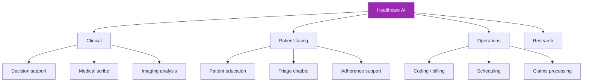
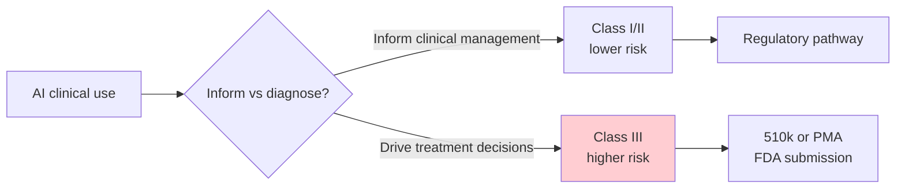

# Day 109: Healthcare AI 🏥

<div class="lesson-meta">
⏱️ 3 ชั่วโมง &nbsp;|&nbsp; 📊 Vertical &nbsp;|&nbsp; 📋 Prerequisites: Day 101
</div>

## 🎯 Learning Objectives

<ul class="objectives">
<li>เห็น healthcare-specific patterns</li>
<li>Build medical scribe + decision support</li>
<li>เข้าใจ BAA + Safe Harbor in practice</li>
</ul>

---

## 1. Healthcare AI Landscape



---

## 2. Regulatory Stack

```
HIPAA (US) — privacy + security
FDA SaMD — Software as Medical Device classification
EU MDR/IVDR — medical device regulation EU
EU AI Act — high-risk if affects health decisions
Thai PDPA + Medical Council rules
21 CFR Part 11 — electronic records (clinical trials)
```

→ Layer regs → most complex compliance environment

---

## 3. FDA SaMD Risk Classification



Avoid SaMD by:
- AI = informational only
- Human clinician makes all decisions
- Output: "consider X" not "treat with X"
- Documentation makes scope clear

---

## 4. Medical Scribe Pattern

```python
SCRIBE_SYSTEM = """You are a medical scribe assistant.

Your task: structure clinical encounter audio into SOAP note.

S - Subjective: patient's complaint, symptoms (in patient's words)
O - Objective: vitals, exam findings, lab results
A - Assessment: differential diagnoses (clinician-stated)
P - Plan: treatments, follow-ups, education

Rules:
- ONLY use what was stated; do not infer
- Use clinician's exact medical terminology
- Flag ambiguous items as [CLARIFY: ...]
- Do NOT include differential diagnoses unless clinician stated them
- Mark patient-stated info as [pt reports] vs objective findings
- Preserve negatives ("denies chest pain")
- Use abbreviations the clinician used (no auto-expansion)

Output structured JSON for EHR integration.
"""

class SOAPNote(BaseModel):
    subjective: str
    objective: dict  # vitals, exam, labs
    assessment: list[str]  # differential diagnoses
    plan: list[dict]  # interventions
    coding_suggestions: list[dict]  # ICD-10 / CPT — for review only
    clarifications_needed: list[str]
```

→ Scribe ≠ diagnosis. Clinician reviews + edits + signs.

---

## 5. Clinical Decision Support (CDS)

```python
CDS_SYSTEM = """You provide clinical decision support — INFORMATION ONLY.

Patient context:
{deidentified_summary}

Clinician question: {question}

Provide:
1. Relevant guidelines (cite specific guideline + section)
2. Drug interactions to consider (with severity)
3. Differential considerations (educational, not prescriptive)
4. Lab/imaging suggestions for workup

CRITICAL:
- You are NOT making clinical decisions
- Cite sources (guideline name + year + section)
- Flag uncertainty
- Never recommend specific dosing without "verify in formulary"
- Recommend specialist consultation for complex cases
"""

# Plus: clinician confirms all suggestions before any are acted on
```

---

## 6. Patient-Facing Triage Chatbot

```python
TRIAGE_SYSTEM = """You are a patient triage assistant.

YOUR ROLE:
- Help patients understand if they should seek care
- Provide general health education
- NEVER diagnose
- NEVER prescribe or recommend specific treatments

ESCALATE IMMEDIATELY for:
- Chest pain, difficulty breathing
- Stroke signs (FAST)
- Severe bleeding
- Suicidal/self-harm thoughts
- Pregnancy emergencies
- Severe allergic reaction
- Pediatric serious symptoms

For escalation:
"Please call emergency services (1669 in Thailand / 911 in US) immediately."

For non-urgent:
- Suggest appropriate care level (ER / urgent care / primary care / home care)
- Provide general info
- Always remind: "This is not medical advice. Consult your physician."
"""
```

⚠️ **Vulnerable user detection** is critical — kids, mental health, elderly

---

## 7. PHI Handling Pipeline

```python
def safe_clinical_ai_request(raw_clinical_text, action):
    # Step 1: De-identify (Safe Harbor)
    deid = safe_harbor_deid(raw_clinical_text)
    
    # Step 2: Verify de-identification
    if contains_phi(deid):
        return {"error": "PHI not fully removed", "redo": True}
    
    # Step 3: BAA-covered LLM call
    response = bedrock_claude(deid)  # Bedrock has BAA with AWS
    
    # Step 4: Output filter (in case LLM hallucinated PHI)
    response = filter_phi_from_output(response)
    
    # Step 5: Audit log (does not include PHI)
    audit_log({
        "action": action,
        "deid_hash": hash(deid),  # tracks input shape, not content
        "model": "claude-sonnet-4-6",
        "timestamp": now(),
        "user_id": clinician_id
    })
    
    return response
```

---

## 8. Imaging — Defer to Specialized Models

Claude vision good for:
- Document/PDF extraction (Day 94-96)
- Chart QA
- Education materials

**Not for**: medical imaging diagnosis. Use:
- Cleared SaMD vendors (Aidoc, Annalise, Zebra)
- Specialized models trained on labeled medical imagery
- Claude can SUMMARIZE / discuss the imaging report, not interpret images

---

## 9. Drug-Drug Interaction Check Pattern

```python
def ddi_check(medications: list[str], new_drug: str):
    # 1. Authoritative database (not LLM!)
    interactions = drug_db.check_interactions(medications + [new_drug])
    
    # 2. LLM explains in clinician-friendly language
    if interactions:
        explanation = client.messages.create(
            model="claude-sonnet-4-6",
            system="Summarize drug interactions clearly for clinician. Cite sources from input.",
            messages=[{"role": "user", "content": json.dumps(interactions)}]
        )
        return {
            "interactions": interactions,
            "summary": explanation.content[0].text,
            "source": "First Databank / Lexicomp / etc."
        }
    return {"interactions": [], "summary": "No major interactions found"}
```

→ Source of truth = authoritative DB, LLM is presentation layer

---

## 10. Case Pattern: Hospital Deployment

```markdown
# Architecture
- Cloud: AWS HIPAA-eligible services
- LLM: Claude via Bedrock with AWS BAA
- Network: VPC private, no internet egress
- Storage: Encrypted at rest, retention per policy
- Auth: Hospital SSO + MFA + role-based (clinician/nurse/admin)
- PHI: De-identified before LLM where possible; otherwise within BAA boundary

# Use Cases (initial deploy)
- Medical scribe (clinician reviews/signs)
- Patient education content generation (template + custom)
- Discharge instructions in patient's language
- Internal Q&A (policies, formulary)

# Out of Scope (initial)
- Direct diagnostic advice
- Treatment recommendations
- Automated medication ordering
- Triage to specific specialists

# Approval Process
- Each use case → IRB / Ethics Committee review
- Clinical lead sign-off
- Risk assessment per use case
- Quarterly review with incident analysis
```

---

## 🛠️ Hands-on Exercise

!!! example "Exercise 1: Safe Harbor"
    Build de-identifier covering all 18 HIPAA identifiers → test on synthetic notes

!!! example "Exercise 2: SOAP Scribe"
    Build scribe that converts transcript → SOAP JSON → verify on 3 samples

!!! example "Exercise 3: Triage Bot"
    Build triage with red-flag escalation → test 10 scenarios (5 emergency, 5 routine)

---

## ✅ Self-Check Quiz

<div class="quiz">

**Q1:** ทำไม drug interaction check ต้องใช้ authoritative DB?

??? success "ดูคำตอบ"
    - LLM might miss interactions or hallucinate non-existent ones
    - Drug DBs maintained by specialists (FDA, Lexicomp, etc.) — clinical-grade
    - Liability — using AI's "feeling" about drug interactions for clinical decisions is unacceptable
    - LLM = presentation layer; truth = DB

**Q2:** Why escalate Mental Health red flags?

??? success "ดูคำตอบ"
    - High-stakes harm if missed
    - Vulnerability requires human responder
    - Many AI services prohibited from giving therapy
    - Specialized crisis lines + trained professionals exist
    - AI should connect to those resources, not substitute

</div>

---

## 🔍 Cross-check & References

- 📘 [HIPAA + AI Guidance (HHS)](https://www.hhs.gov/hipaa/for-professionals/index.html)
- 📘 [FDA SaMD](https://www.fda.gov/medical-devices/software-medical-device-samd)
- 📘 [AWS HIPAA on Bedrock](https://aws.amazon.com/compliance/hipaa-compliance/)

[ต่อไป → Day 110: Education AI :material-arrow-right:](day-110.md){ .md-button .md-button--primary }
