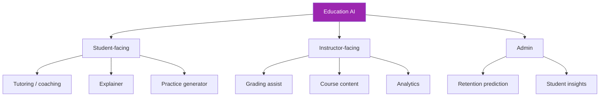

# Day 110: Education AI 🎓

<div class="lesson-meta">
⏱️ 3 ชั่วโมง &nbsp;|&nbsp; 📊 Vertical &nbsp;|&nbsp; 📋 Prerequisites: Day 100, 105
</div>

## 🎯 Learning Objectives

<ul class="objectives">
<li>Build tutoring AI ที่ไม่ "ตอบให้"</li>
<li>Auto-grading with rubric + human override</li>
<li>FERPA + minor protections</li>
</ul>

---

## 1. Education AI Use Cases



---

## 2. Tutoring Pattern — Socratic

Avoid: just giving answers (academic dishonesty + impedes learning)

```python
TUTOR_SYSTEM = """You are a tutor for {subject}.

Pedagogy:
- Socratic method: ask questions to guide
- NEVER give direct answers to homework
- Explain concepts when student understands fundamentals
- Acknowledge effort + progress
- Adapt difficulty to student level

Anti-cheating:
- If student asks for "the answer" → redirect to questions
- If student shares assignment text verbatim → suggest understanding first
- Flag if interaction pattern looks like cheating attempt

Format:
- Brief responses (voice/chat friendly)
- One question or one concept at a time
- Praise specific effort, not generic ("nice work" → "I see you spotted the pattern")
"""
```

Check progress detection:
```python
def detect_struggle(session):
    """Adjust difficulty if student struggling"""
    last_5_attempts = session.recent_attempts[-5:]
    success_rate = sum(a.correct for a in last_5_attempts) / 5
    
    if success_rate < 0.3:
        return "lower_difficulty"
    elif success_rate > 0.85:
        return "raise_difficulty"
    return "maintain"
```

---

## 3. Practice Problem Generator

```python
def gen_practice(topic, difficulty, n=5, student_history=None):
    # Avoid duplicates
    seen = student_history.get_topics_seen() if student_history else []
    
    prompt = f"""Generate {n} practice problems on {topic}.
Difficulty: {difficulty}
Avoid these previously-seen problem patterns: {seen[:20]}

For each problem:
- problem text
- 3-4 multiple choice options (or "open" if free response)
- correct answer
- explanation (revealed after attempt)
- common misconceptions / wrong-answer traps

Output JSON array."""
    
    resp = client.messages.create(
        model="claude-sonnet-4-6",
        max_tokens=3000,
        messages=[{"role": "user", "content": prompt}]
    )
    return json.loads(resp.content[0].text)
```

→ Personalized practice without instructor manually authoring

---

## 4. Grading Assist Pattern

```python
GRADING_SYSTEM = """Grade this student response using the rubric.

Rubric:
{rubric_json}

Student response:
{response}

For each criterion:
- score (0 to max defined in rubric)
- reasoning (cite specific parts of response)
- feedback for student (constructive)

Total: sum of criteria scores.

Tone:
- Specific, actionable feedback
- Acknowledge what's correct first
- Suggest how to improve (not just what's wrong)
"""

def grade_with_review(response, rubric):
    # AI proposes
    ai_grade = ai_grade_response(response, rubric)
    
    # Flag uncertain for human review
    if ai_grade["confidence"] < 0.8 or ai_grade["total_score"] / rubric["max"] < 0.5:
        ai_grade["needs_review"] = True
    
    # Always: instructor sees AI grade as draft
    return {"ai_proposal": ai_grade, "final": None, "instructor_review_required": True}
```

→ Instructor approves / modifies; AI never final-grades critical work

---

## 5. FERPA + Minor Protections

```markdown
## Mandatory controls for education
- Parental consent for under-13 (COPPA) and under-18 (FERPA)
- Education record access: only school officials with legitimate need
- AI vendor = school official (with contract restricting use)
- No advertising / data monetization
- Right of parents to review records
- Data destruction at end of relationship
```

### Consent Flow

```python
class EduConsentManager:
    def can_use_ai(self, student_id):
        student = get_student(student_id)
        
        # Under 13: need parental consent + school
        if student.age < 13:
            return all([
                self.has_parental_consent(student_id, "ai_use"),
                self.has_school_authorization(student.school_id, "ai_use")
            ])
        
        # 13-17: school consent + opt-out for parents
        if student.age < 18:
            if self.has_parent_opted_out(student_id):
                return False
            return self.has_school_authorization(student.school_id, "ai_use")
        
        # Adult learners: own consent
        return self.has_user_consent(student_id, "ai_use")
```

---

## 6. Academic Integrity

```python
def detect_academic_integrity_concerns(interaction):
    concerns = []
    
    # Pattern: pasting assignment verbatim
    if looks_like_assignment_text(interaction.input):
        concerns.append("possible_homework_paste")
    
    # Pattern: requesting essay
    if matches_essay_request_pattern(interaction.input):
        concerns.append("possible_essay_request")
    
    # Pattern: requesting "solution" without learning
    if "give me the answer" in interaction.input.lower():
        concerns.append("solution_seeking")
    
    return concerns

# Response strategy
def respond_to_integrity_concern(concern):
    if concern == "possible_essay_request":
        return """I notice you might be asking me to write an essay.
I can help you:
- Brainstorm topics
- Outline structure
- Review YOUR draft
- Discuss arguments

But the writing must be yours. Want to start with brainstorming?"""
```

---

## 7. Bias in Education AI

Watch for:
- **Differential performance** by student demographic (test by group)
- **Language bias** (EAL/ELL students penalized)
- **Names bias** (stereotypical names affecting grades)
- **Topic bias** (gendered/cultural assumptions)

```python
def bias_test_grading():
    # Same content, different attributes
    base_essay = "..."  # well-written essay
    
    variants = [
        {"name": "John Smith", "topic": "football"},
        {"name": "Jane Doe", "topic": "ballet"},
        {"name": "Ahmed Ali", "topic": "cricket"},
        {"name": "Mei Lin", "topic": "calligraphy"},
    ]
    
    grades = []
    for v in variants:
        essay = personalize(base_essay, v)
        grade = ai_grade(essay, rubric)
        grades.append({"variant": v, "grade": grade["total"]})
    
    # All should be within ±5%
    return grades
```

---

## 8. Student-Facing Disclaimers

```markdown
## Always show:
"This AI tutor:
- Helps you learn — doesn't do work for you
- May make mistakes — verify important facts
- Records conversations for safety + improvement
- Reports concerns about your safety to school
- Your data is protected under [policy link]
- Your parents can [review/opt out]"
```

---

## 9. Special Educational Needs

- Larger font / TTS for accessibility
- Cognitive load adjustments
- Patience with repetition
- Anxiety-aware response patterns
- Escalation if student expresses distress

```python
DISTRESS_KEYWORDS = ["don't understand anything", "I'm stupid", "give up", "I can't"]

def check_emotional_state(session):
    last_5 = " ".join(m["content"] for m in session.messages[-5:])
    if any(k in last_5.lower() for k in DISTRESS_KEYWORDS):
        return "supportive_response_needed"
    return "normal"

# Supportive response
SUPPORTIVE = """It's okay to find this hard. Let's slow down and take it step by step.
What's one specific part that's confusing? We'll figure it out together."""
```

---

## 10. Vendor Landscape

| Tool | Strength |
|------|----------|
| **DIY Claude** | Curriculum alignment |
| Khan Academy Khanmigo | K-12 tutoring |
| Coursera AI | Higher ed |
| Duolingo Max | Language learning |
| Quizlet AI | Study aids |
| ScribeSense | K-12 assessment |
| MagicSchool | Teacher-facing |

→ Many K-12 schools required to choose FERPA-compliant vendors with school agreements

---

## 🛠️ Hands-on Exercise

!!! example "Exercise 1: Socratic Tutor"
    Build tutor that resists giving answers + practice 10 turns

!!! example "Exercise 2: Bias Test"
    Generate 20 essay variants × demographics, grade with AI, measure parity

!!! example "Exercise 3: Consent Flow"
    Build age-aware consent flow (under 13, 13-17, 18+)

---

## ✅ Self-Check Quiz

<div class="quiz">

**Q1:** ทำไม AI grading ต้อง human override?

??? success "ดูคำตอบ"
    - Critical decisions (grades, GPA) impact futures
    - Bias undetected without monitoring
    - Edge cases (creative answers, language differences) AI may misread
    - Student appeal rights
    - Liability — institution responsible, not AI

**Q2:** Under-13 vs 13-17 consent?

??? success "ดูคำตอบ"
    - Under 13: COPPA requires verifiable parental consent + school
    - 13-17: FERPA — school official + parental opt-out rights
    - 18+: own consent
    - Always: data minimization for minors

</div>

---

## 🔍 Cross-check & References

- 📘 [FERPA Guidance](https://studentprivacy.ed.gov/)
- 📘 [COPPA](https://www.ftc.gov/business-guidance/privacy-security/childrens-privacy)
- 📺 [AI for Good — Education (DLAI)](https://www.deeplearning.ai/courses/)

[ต่อไป → Day 111: Compare Playbooks :material-arrow-right:](day-111.md){ .md-button .md-button--primary }
