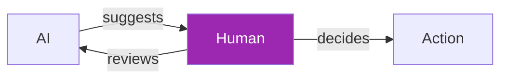
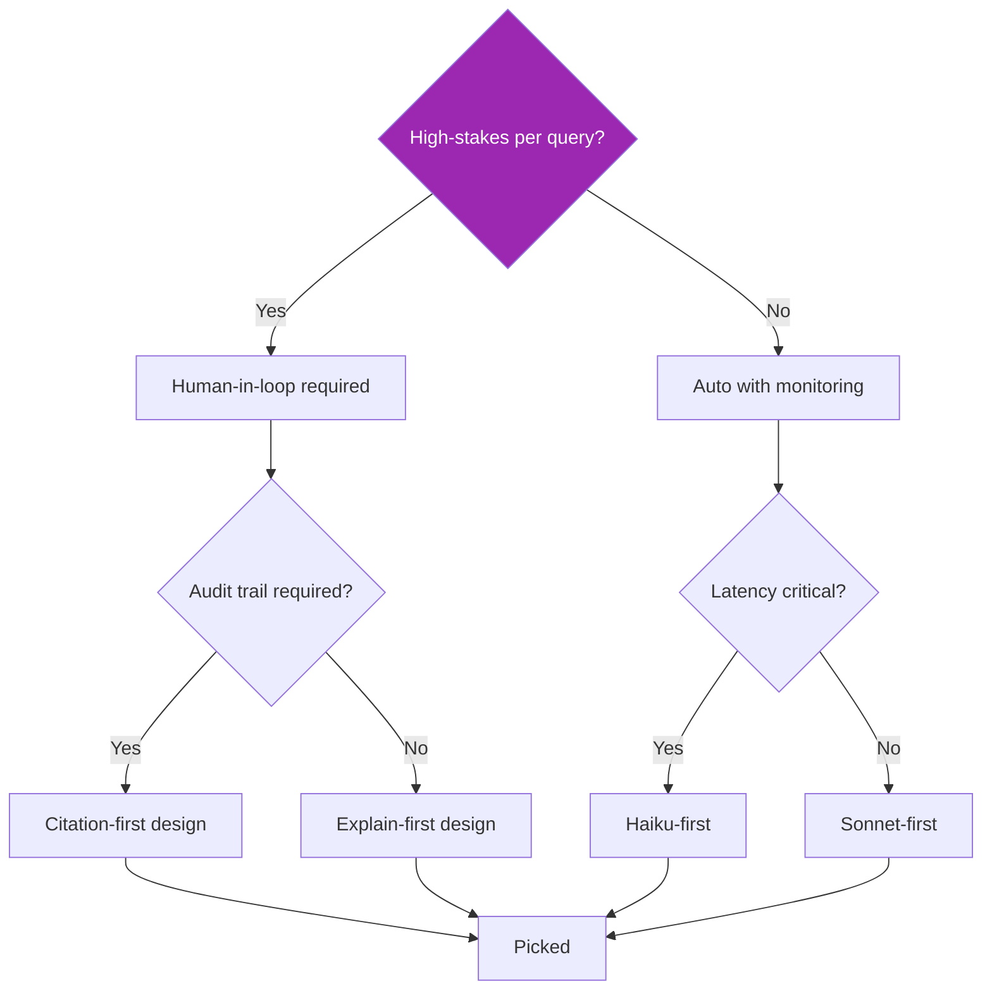
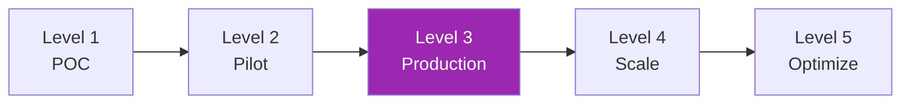

# Day 111: Comparing Playbooks 🧭

<div class="lesson-meta">
⏱️ 3 ชั่วโมง &nbsp;|&nbsp; 📊 Synthesis &nbsp;|&nbsp; 📋 Prerequisites: Day 105-110
</div>

## 🎯 Goal

Cross-vertical synthesis — extract reusable patterns + understand differences

---

## 1. Cross-Vertical Matrix

| Dimension | Support | Coding | Legal | Finance | Healthcare | Education |
|-----------|---------|--------|-------|---------|-----------|-----------|
| **Auto vs Assist** | Tier 0 auto OK | Assist mostly | Assist only | Assist mostly | Assist only | Assist (tutoring auto) |
| **Citation criticality** | Medium | Low-Med | Critical | High | Critical | Medium |
| **Human in loop** | Escalate as needed | PR review | Always | Decisions critical | Always for decisions | Grading review |
| **Regulatory** | Sector-specific | IP/licensing | UPL | PCI/SOX/FINRA | HIPAA/FDA | FERPA/COPPA |
| **Latency sensitivity** | High (chat) | Low-Med | Low | Real-time fraud | Real-time triage | Med (tutoring) |
| **Volume** | Very high | Med | Low | Very high | High | High |
| **Best model** | Haiku+Sonnet | Sonnet+Opus | Opus | Haiku+Sonnet | Sonnet+Opus | Sonnet |
| **Top risk** | Hallucination | Security bugs | Wrong citations | Fraud miss/false pos | Patient harm | Academic dishonesty |

---

## 2. Common Patterns (Reusable)

### Pattern: Tiered Decision Support
- AI = explainer / first pass
- Human = decision maker
- Audit trail of AI's contribution



### Pattern: Specialized Tool Backbone
- Domain-specific tool (drug DB, case law DB, fraud rules)
- LLM = orchestration + explanation
- Source of truth ≠ LLM

### Pattern: Vulnerability-Aware Triage
- Detect vulnerable populations (minor, distressed, etc.)
- Auto-escalate to human or specialist
- Lower thresholds for human involvement

### Pattern: Compliance-First Architecture
- BAA / DPA chain
- PII de-identification
- Audit log
- Retention policy
- Right to delete

### Pattern: Eval Loop
- Golden test set per vertical risk
- Bias testing across protected attributes
- Drift monitoring
- Domain expert in loop

---

## 3. Vertical-Specific Differentiators

### Support
- High volume → Haiku-heavy economic
- CSAT measurable
- Deflection metrics

### Coding
- Context heavy → caching critical
- Determinism less critical (creative)
- IP/training data concerns

### Legal
- Provenance critical (paragraph-level)
- Hallucination = career-damaging
- High value per query → Opus OK

### Finance
- Latency for real-time (fraud)
- Audit trail mandatory
- Bias = legal liability (fair lending)

### Healthcare
- BAA + Safe Harbor non-negotiable
- Patient safety > efficiency
- Defer to authoritative DBs

### Education
- Pedagogy (don't just answer)
- Minor protections
- Long-term outcomes (not just task completion)

---

## 4. Decision Framework — Picking a Vertical Approach



---

## 5. Common Anti-Patterns

❌ **"AI as decision-maker"** — almost always wrong in regulated industries
❌ **No source of truth fallback** — LLM hallucinates, no recovery
❌ **Skipping bias testing** — discovered too late = regulatory issue
❌ **One-size-fits-all model** — Opus for support = burning $$$
❌ **No vulnerability detection** — minors, distress, emergencies missed
❌ **No audit trail** — regulator can't reconstruct
❌ **AI advice without disclaimers** — UPL / unlicensed practice risk
❌ **Treating compliance as separate** — should be in architecture from day 0

---

## 6. Maturity Model



| Level | Hallmark | Common gap |
|-------|----------|-----------|
| L1 POC | One workflow works | No eval, no audit |
| L2 Pilot | Limited users, measured | Manual ops |
| L3 Production | SLOs, eval CI, alerts | Bias monitoring, runbook |
| L4 Scale | Multi-vertical, multi-region | Cost optimization, tier 2 specialists |
| L5 Optimize | Cost+carbon+quality balance | Continuous improvement culture |

→ Most enterprises stuck at L2 — need L3 patterns from this course

---

## 7. Picking Patterns for Your Context

```markdown
# Vertical Patterns Selector

## Context
- Industry: [healthcare / finance / etc.]
- Audience: [B2C / B2B / internal]
- Volume: [low / medium / high]
- Risk tier: [low / medium / high / critical]
- Region: [US / EU / TH / multi]

## Selected Patterns
- [ ] Tiered decision support (✓ if high-risk per query)
- [ ] Specialized DB backbone (✓ if domain has authoritative source)
- [ ] Vulnerability detection (✓ if minors / health / distress)
- [ ] Citation provenance (✓ if legal / clinical / financial)
- [ ] BAA chain (✓ if PHI involved)
- [ ] Audit trail (✓ if regulated)
- [ ] Bias testing (✓ if protected attributes affected)
- [ ] Real-time fraud detection (✓ if finance)
- [ ] Socratic limiting (✓ if education)
- [ ] Recording consent (✓ if voice)
```

---

## 8. Migration / Transformation Roadmap (SA-style)

```markdown
# Quarter-by-quarter AI Maturity Plan

## Q1 — Foundation
- Pick 1 vertical use case (lowest risk)
- Build with compliance from day 0
- Establish observability + eval baseline

## Q2 — Production Hardening
- L3 maturity for first use case
- Add 2nd use case (different vertical / lower risk if Q1 was high)
- LLMOps maturity (CI, red team, runbook)

## Q3 — Cross-Cutting
- Compliance bundle complete (audit-ready)
- Add 3rd-5th use cases
- Cross-vertical patterns library

## Q4 — Optimization
- Cost + carbon optimization
- Distillation for high-volume patterns
- 24/7 carbon-aware scheduling
- Multi-region resilience
```

---

## 9. SA Hat: Selling AI Programs Internally

Stakeholder objections + answers:

| Objection | SA response |
|-----------|------------|
| "AI hallucinates" | Show provenance system + eval CI + monitoring |
| "Compliance can't be done" | Show framework mapping (Day 99, 104) |
| "Too expensive" | Show cost optimization (Day 80, 103) + model routing |
| "Vendor lock-in" | Show abstractions (LiteLLM, OTel) + multi-cloud (Day 59) |
| "Liability" | Show human-in-loop + audit trail + insurance |
| "PII risk" | Show PII pipeline (Day 100) + BAA chain |
| "Bias / fairness" | Show fairness eval (Day 98) + monitoring (Day 88) |
| "Carbon footprint" | Show measurement (Day 102) + green patterns (Day 103) |

---

## 10. Capstone Reflection

```markdown
# Reflect on Your Capstone (Day 90)

For each pattern from Day 105-110, ask:
- Did you apply it? (✓/✗)
- Should you have? (✓/✗ — what's the gap)
- For next iteration, prioritize which 3 new patterns?

If you're working in a specific vertical (Day 105-110 closest to you):
- What gaps are most critical?
- What's reusable from your existing work?
- What's the simplest first step?
```

---

## ✅ Week 15 Self-Check

- [x] Customer Support AI
- [x] Coding Agents
- [x] Legal AI
- [x] Financial Services
- [x] Healthcare
- [x] Education
- [x] Cross-cutting patterns + decision framework

---

## 🔍 Cross-check & References

- 📘 [Anthropic — Customers / Industries](https://www.anthropic.com/customers)
- 📘 [McKinsey — State of AI](https://www.mckinsey.com/capabilities/quantumblack/our-insights)

---

:material-check-decagram: **จบ Week 15!** เหลือ Week 16 — Advanced MCP & A2A

[ต่อไป → Week 16: Advanced MCP & A2A :material-arrow-right:](../week-16/index.md){ .md-button .md-button--primary }
