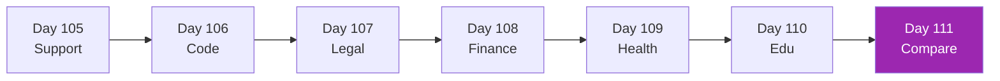

# Week 15: Vertical Use Cases 🏢

Playbooks สำหรับ 6 enterprise verticals

| Day | Vertical | เวลา |
|-----|----------|------|
| 105 | Customer Support AI | 3h |
| 106 | Enterprise Coding Agents | 3h |
| 107 | Legal AI | 3h |
| 108 | Financial Services AI | 3h |
| 109 | Healthcare AI | 3h |
| 110 | Education AI | 3h |
| 111 | Comparing playbooks + decision framework | 3h |

[เริ่ม Day 105 :material-arrow-right:](day-105.md){ .md-button .md-button--primary }
