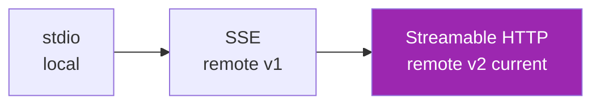
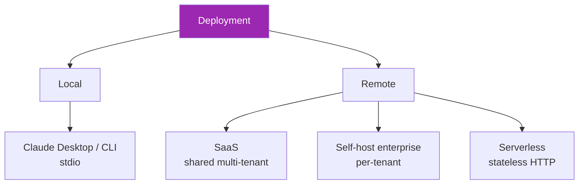

# Day 112: MCP Transports 🚇

<div class="lesson-meta">
⏱️ 3 ชั่วโมง &nbsp;|&nbsp; 📊 Advanced &nbsp;|&nbsp; 📋 Prerequisites: Day 28 (MCP intro)
</div>

## 🎯 Learning Objectives

<ul class="objectives">
<li>เข้าใจ 3 transport options ของ MCP</li>
<li>เลือก transport ตาม deployment context</li>
<li>Migrate from SSE → Streamable HTTP</li>
</ul>

---

## 1. MCP Transport Evolution



- **stdio**: process pipe — local desktop apps (Claude Desktop)
- **SSE (Server-Sent Events)**: remote v1 — deprecated, complex with reconnection
- **Streamable HTTP**: current — single endpoint, supports streaming + non-streaming

---

## 2. stdio Transport

For local servers (Claude Desktop, CLI agents):

```json
// claude_desktop_config.json
{
  "mcpServers": {
    "my-server": {
      "command": "python",
      "args": ["/path/to/my_server.py"],
      "env": {"MY_API_KEY": "..."}
    }
  }
}
```

```python
# Server side
from mcp.server import Server
from mcp.server.stdio import stdio_server

server = Server("my-server")

@server.list_tools()
async def list_tools():
    return [{"name": "...", ...}]

@server.call_tool()
async def call_tool(name, args):
    # ...
    return [TextContent(...)]

async def main():
    async with stdio_server() as (read, write):
        await server.run(read, write, server.create_initialization_options())
```

**Pros**: Simple, no network, secure (only local)  
**Cons**: Single user, no remote access

---

## 3. Streamable HTTP (Current Standard)

Replaces SSE for remote servers:

```python
from mcp.server.streamable_http import StreamableHTTPServerTransport
from mcp.server import Server
import uvicorn
from starlette.applications import Starlette
from starlette.routing import Route

server = Server("my-server")

# ... define tools ...

async def mcp_endpoint(request):
    transport = StreamableHTTPServerTransport(
        server=server,
        path="/mcp"
    )
    return await transport.handle_request(request)

app = Starlette(routes=[Route("/mcp", mcp_endpoint, methods=["GET", "POST", "DELETE"])])

if __name__ == "__main__":
    uvicorn.run(app, host="0.0.0.0", port=8000)
```

Client:
```python
from mcp import ClientSession
from mcp.client.streamable_http import streamablehttp_client

async with streamablehttp_client("http://server.com/mcp") as (read, write, _):
    async with ClientSession(read, write) as session:
        await session.initialize()
        tools = await session.list_tools()
```

---

## 4. Why Streamable HTTP Wins

| | SSE (v1) | Streamable HTTP |
|--|----------|-----------------|
| Endpoints | 2 (SSE + POST) | 1 |
| Connection | Long-lived SSE | Short or long |
| Session resumability | Manual | Built-in |
| Streaming | Required | Optional |
| Stateless mode | No | Yes |
| Load balancer friendly | Poor | Good |
| OAuth integration | Awkward | Clean |

→ Migrate from SSE if you have existing server

---

## 5. Streaming Tool Responses

```python
from mcp.types import TextContent

@server.call_tool()
async def long_running_task(name, args):
    # Server can stream progress via notifications
    async def stream():
        for i in range(10):
            await server.send_notification(
                "progress",
                {"step": i, "total": 10}
            )
            yield TextContent(type="text", text=f"Step {i}/10")
            await asyncio.sleep(1)
    
    return [item async for item in stream()]
```

Client sees incremental updates → better UX for long tasks

---

## 6. Session Management

Streamable HTTP supports session IDs:

```python
# Server attaches session via mcp-session-id header
# Client maintains across requests
# Enables server-side state (without sticky load balancer)

# Stateless option: no session state, all info in each call
# Good for serverless deployment
```

---

## 7. Multi-Transport Server

One server, multiple deployments:

```python
def create_server(transport: str):
    server = Server("multi-transport")
    
    # Common tool definitions...
    @server.list_tools()
    async def list_tools(): ...
    
    if transport == "stdio":
        return stdio_main(server)
    elif transport == "http":
        return http_main(server)

# Deploy stdio for desktop users
# Deploy HTTP for SaaS / remote agents
# Same tool implementations
```

---

## 8. Anthropic-Specific Considerations

**Claude API connectors** (mcp_servers parameter in API request):
- Accept HTTP URL pointing to remote MCP server
- Pass auth via headers / bearer
- Claude initiates connection per request

```python
import anthropic

client = anthropic.Anthropic()

resp = client.messages.create(
    model="claude-sonnet-4-6",
    max_tokens=1000,
    mcp_servers=[
        {
            "type": "url",
            "url": "https://my-mcp-server.com/mcp",
            "name": "my-data-server",
            "authorization_token": "Bearer ..."
        }
    ],
    messages=[{"role": "user", "content": "Use my data server to ..."}]
)
```

→ See latest docs for exact API shape; this is the high-level pattern

---

## 9. Deployment Patterns



- **stdio**: developer workstations
- **Multi-tenant SaaS**: managed service, OAuth per tenant
- **Single-tenant**: enterprise, private deployment
- **Serverless**: Lambda + API Gateway, stateless mode

---

## 10. Latency & Cost Considerations

```
MCP overhead per tool call:
- stdio: 1-5ms (process IPC)
- HTTP local: 5-20ms
- HTTP remote: 20-200ms (network)
- HTTP with auth: + 10-50ms (OAuth verify)

Cost factors:
- HTTP egress
- Auth verifications
- Compute for tool execution
```

For latency-sensitive (voice agents): prefer local tools where possible

---

## 🛠️ Hands-on Exercise

!!! example "Exercise 1: stdio Server"
    Build minimal stdio server with 2 tools → connect via Claude Desktop

!!! example "Exercise 2: Streamable HTTP"
    Convert to HTTP → deploy locally → connect via Anthropic API

!!! example "Exercise 3: Migration"
    If you have SSE server — write migration plan to Streamable HTTP

---

## ✅ Self-Check Quiz

<div class="quiz">

**Q1:** ทำไม stdio limited?

??? success "ดูคำตอบ"
    - Process IPC → single user, single machine
    - No network → no shared service
    - Auth via env vars (not OAuth)
    - Great for Claude Desktop, not for shared SaaS

**Q2:** Stateless HTTP vs stateful session?

??? success "ดูคำตอบ"
    - Stateless: easier scale (serverless, any LB), all context in calls
    - Stateful: server-side context (cheaper if context is large + reused), needs sticky/coordinated session storage
    - Modern MCP: optional state → can choose per server

</div>

---

## 🔍 Cross-check & References

- 📘 [MCP Spec](https://modelcontextprotocol.io/)
- 📘 [MCP Transports](https://modelcontextprotocol.io/docs/concepts/transports)
- 📘 [Anthropic MCP Connectors](https://docs.claude.com/en/docs/agents-and-tools/mcp)

[ต่อไป → Day 113: MCP OAuth + Multi-tenant :material-arrow-right:](day-113.md){ .md-button .md-button--primary }
