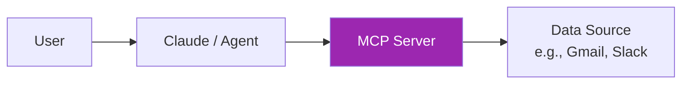
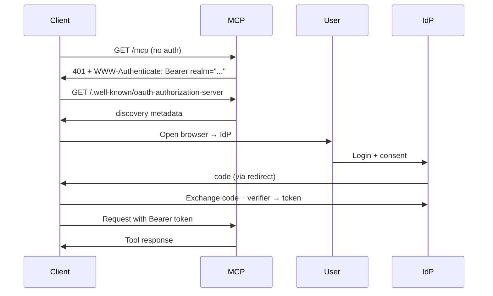
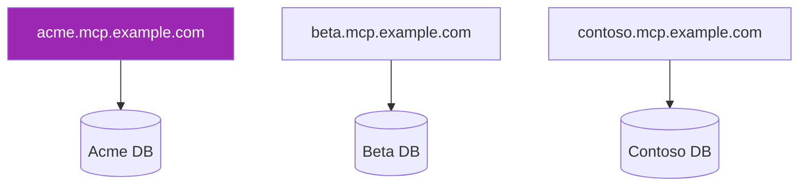

# Day 113: MCP OAuth + Multi-Tenant 🔐

<div class="lesson-meta">
⏱️ 4 ชั่วโมง &nbsp;|&nbsp; 📊 Advanced &nbsp;|&nbsp; 📋 Prerequisites: Day 112
</div>

## 🎯 Learning Objectives

<ul class="objectives">
<li>Implement OAuth 2.1 in MCP server</li>
<li>Build multi-tenant isolation</li>
<li>Handle token refresh + revocation</li>
</ul>

---

## 1. Why OAuth in MCP



Problem: MCP server needs to access **user's** data (their Gmail, their Slack, etc.) — not server-owned data

OAuth flow:
1. Agent connects → server requires auth
2. User redirected to OAuth provider (Google, Slack, etc.)
3. User consents
4. Server gets access token (user-specific)
5. Server uses token to access user's data

---

## 2. MCP OAuth 2.1 Spec

MCP follows OAuth 2.1 with PKCE (Proof Key for Code Exchange):



---

## 3. Server Implementation

```python
from mcp.server.streamable_http import StreamableHTTPServerTransport
from mcp.server.auth.provider import OAuthAuthorizationServerProvider
from mcp.server.auth.routes import create_auth_routes

# Configure OAuth provider
class MyOAuthProvider(OAuthAuthorizationServerProvider):
    async def authorize(self, client_id, redirect_uri, state, code_challenge, scope):
        # Redirect user to actual IdP (e.g., Google, Auth0)
        idp_url = build_idp_redirect(client_id, redirect_uri, state, code_challenge, scope)
        return idp_url
    
    async def exchange_code(self, code, redirect_uri, code_verifier):
        # Verify code → fetch token from IdP
        token = await idp_client.exchange(code, code_verifier)
        return {
            "access_token": token["access_token"],
            "refresh_token": token["refresh_token"],
            "expires_in": token["expires_in"],
            "token_type": "Bearer"
        }
    
    async def verify_token(self, token):
        # Verify with IdP introspection or JWT verify
        result = await idp_client.introspect(token)
        if not result["active"]:
            raise InvalidToken
        return UserInfo(
            user_id=result["sub"],
            scopes=result["scope"].split(),
            tenant_id=result.get("tenant_id")
        )

provider = MyOAuthProvider(...)

# Mount auth routes
auth_routes = create_auth_routes(provider)
app.routes.extend(auth_routes)
```

---

## 4. Tool-Level Auth

```python
from mcp.server.auth.middleware import require_auth

@server.call_tool()
@require_auth(scopes=["email.read"])
async def list_emails(name, args, user_info):
    # user_info populated from validated token
    user_token = await get_user_token(user_info.user_id)
    
    emails = await gmail_client.list(user_token, limit=args.get("limit", 10))
    return [TextContent(type="text", text=json.dumps(emails))]
```

→ Each tool can require specific scopes

---

## 5. Multi-Tenancy Models

### Model A: Tenant per OAuth scope

```python
# Token carries tenant claim
user_info = await verify_token(token)
tenant_id = user_info.tenant_id  # from token

# Filter all data by tenant
@server.call_tool()
async def list_docs(name, args, user_info):
    return await db.list(tenant_id=user_info.tenant_id)
```

### Model B: Per-tenant deployment

Each customer gets their own MCP server instance — isolated by infrastructure



→ Easier compliance, harder ops

### Model C: Per-tenant database, shared compute

```python
# Tenant routing
async def get_tenant_db(tenant_id):
    return db_connections[tenant_id]  # separate DB per tenant

@server.call_tool()
async def query(name, args, user_info):
    db = await get_tenant_db(user_info.tenant_id)
    return await db.execute(...)
```

→ Balance: shared infra, strong data isolation

---

## 6. Token Refresh

```python
class TokenManager:
    async def get_valid_token(self, user_id):
        token = await self.cache.get(f"token:{user_id}")
        
        if not token or token.expires_in_seconds() < 60:
            # Refresh before expiry
            new_token = await self.refresh(token.refresh_token)
            await self.cache.set(f"token:{user_id}", new_token)
            return new_token
        return token
    
    async def refresh(self, refresh_token):
        return await idp_client.refresh(refresh_token)
```

---

## 7. Revocation Handling

```python
@server.call_tool()
async def list_emails(name, args, user_info):
    try:
        token = await token_manager.get_valid_token(user_info.user_id)
        emails = await gmail_client.list(token)
        return [TextContent(...)]
    except TokenRevoked:
        # User revoked consent
        return [TextContent(
            type="text",
            text="Authorization revoked. Please reconnect."
        )]
```

User can revoke from IdP → server gracefully degrades, prompts reconnection

---

## 8. Scopes Best Practices

```python
# Granular scopes
SCOPES = {
    "email.read": "Read your emails",
    "email.send": "Send emails on your behalf",
    "calendar.read": "Read calendar",
    "calendar.write": "Create calendar events",
    "files.read": "Read your files",
    "files.write": "Modify your files"
}

# Tool declares required scopes
TOOLS = {
    "list_emails": ["email.read"],
    "send_email": ["email.send"],  # higher risk → separate scope
    "list_calendar": ["calendar.read"],
    # ...
}
```

→ Least privilege: user grants only what's needed → easier audit + user trust

---

## 9. Audit Logging

```python
@server.call_tool()
@require_auth()
async def any_tool(name, args, user_info):
    audit_log({
        "user_id": user_info.user_id,
        "tenant_id": user_info.tenant_id,
        "tool": name,
        "args": redact_pii(args),
        "timestamp": now(),
        "ip": request.client.host,
        "agent": request.headers.get("user-agent"),
        "session_id": user_info.session_id
    })
    # ... execute tool
```

→ Required for compliance (SOC 2, GDPR, etc.)

---

## 10. Common Pitfalls

❌ Storing tokens unencrypted in DB
❌ Long token lifetimes without refresh
❌ Shared service account instead of user OAuth
❌ Skipping PKCE for "internal" clients
❌ No revocation handling
❌ Logging full tokens (NEVER)
❌ Cross-tenant data leak via shared cache keys
❌ Missing scope enforcement at tool level

---

## 🛠️ Hands-on Exercise

!!! example "Exercise 1: OAuth Server"
    Build MCP server with OAuth (use Auth0 / Keycloak / Authelia for IdP) → 2 tools requiring different scopes

!!! example "Exercise 2: Token Refresh"
    Implement automatic refresh with 60s safety window

!!! example "Exercise 3: Multi-tenant Isolation"
    Build tenant-aware tool + write test for cross-tenant leak

---

## ✅ Self-Check Quiz

<div class="quiz">

**Q1:** ทำไม PKCE ใช้แม้กับ "secure" clients?

??? success "ดูคำตอบ"
    - Defense in depth — protects against authorization code interception
    - Public clients (CLI, mobile) can't safely hold client_secret
    - Recommended in OAuth 2.1 universally
    - Minimal overhead for substantial security gain

**Q2:** Per-tenant DB > shared DB with tenant_id column?

??? success "ดูคำตอบ"
    Pro per-tenant DB:
    - Stronger isolation guarantees
    - Easier per-tenant backups, recovery, deletion
    - Compliance (e.g., data residency per tenant)
    - Resource isolation
    
    Con: More ops complexity, harder cross-tenant analytics
    
    Most enterprises: per-tenant DB for sensitive data, shared with row-level security for ops data

</div>

---

## 🔍 Cross-check & References

- 📘 [MCP Authorization](https://modelcontextprotocol.io/specification/server/authorization)
- 📘 [OAuth 2.1](https://datatracker.ietf.org/doc/draft-ietf-oauth-v2-1/)
- 📘 [RFC 7636 PKCE](https://datatracker.ietf.org/doc/html/rfc7636)

[ต่อไป → Day 114: MCP Scaling :material-arrow-right:](day-114.md){ .md-button .md-button--primary }
