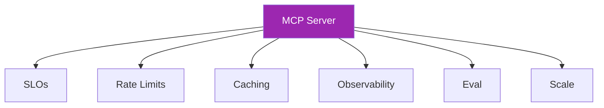

# Day 114: MCP Scaling & Ops 📈

<div class="lesson-meta">
⏱️ 3 ชั่วโมง &nbsp;|&nbsp; 📊 Advanced &nbsp;|&nbsp; 📋 Prerequisites: Day 113
</div>

## 🎯 Learning Objectives

<ul class="objectives">
<li>Apply LLMOps patterns to MCP servers</li>
<li>Rate limit per user/tenant</li>
<li>Cache tool responses smartly</li>
</ul>

---

## 1. MCP Server = Production Service



Apply everything from Week 11 (Days 75-81) to MCP servers

---

## 2. Rate Limiting

```python
from slowapi import Limiter

limiter = Limiter(key_func=lambda req: req.user_info.user_id)

@server.call_tool()
@limiter.limit("60/minute")
async def list_emails(name, args, user_info):
    # ...

# Per-tool, per-tenant limits
TOOL_LIMITS = {
    "list_emails": "60/min/user",
    "send_email": "20/min/user, 1000/day/tenant",  # tighter for risky
    "search_docs": "100/min/user"
}
```

Different limits per scope:
- Read tools: generous
- Write tools: tighter
- Admin tools: very tight

---

## 3. Response Caching

```python
import hashlib
import json

async def call_tool_cached(name, args, user_info):
    # Cache key: tool + user + args
    cache_key = hashlib.sha256(
        f"{name}:{user_info.user_id}:{json.dumps(args, sort_keys=True)}".encode()
    ).hexdigest()
    
    cached = await redis.get(f"mcp:tool:{cache_key}")
    if cached and not is_write_tool(name):
        return json.loads(cached)
    
    result = await actual_tool_call(name, args, user_info)
    
    # Cache reads, not writes
    if not is_write_tool(name):
        await redis.setex(f"mcp:tool:{cache_key}", 300, json.dumps(result))
    
    return result
```

⚠️ Don't cache:
- Write operations
- User-specific PII
- Anything that changes frequently

---

## 4. Observability

```python
from opentelemetry import trace
from prometheus_client import Counter, Histogram

tracer = trace.get_tracer(__name__)

TOOL_CALLS = Counter("mcp_tool_calls", "Tool calls", ["tool", "tenant"])
TOOL_LATENCY = Histogram("mcp_tool_latency", "Tool latency", ["tool"])
TOOL_ERRORS = Counter("mcp_tool_errors", "Tool errors", ["tool", "error_type"])

@server.call_tool()
async def any_tool(name, args, user_info):
    with tracer.start_as_current_span(f"tool.{name}") as span:
        span.set_attribute("user.id", user_info.user_id)
        span.set_attribute("tenant.id", user_info.tenant_id)
        
        TOOL_CALLS.labels(tool=name, tenant=user_info.tenant_id).inc()
        
        with TOOL_LATENCY.labels(tool=name).time():
            try:
                return await execute(name, args)
            except Exception as e:
                TOOL_ERRORS.labels(tool=name, error_type=type(e).__name__).inc()
                span.record_exception(e)
                raise
```

---

## 5. Connection Pooling

For downstream APIs (Gmail, Slack, DB):

```python
import httpx

# Reuse connection pool
http_client = httpx.AsyncClient(
    timeout=10.0,
    limits=httpx.Limits(max_connections=100, max_keepalive_connections=20),
    transport=httpx.AsyncHTTPTransport(retries=3)
)

# Tools use shared client
async def gmail_list(token, limit):
    r = await http_client.get(
        "https://gmail.googleapis.com/...",
        headers={"Authorization": f"Bearer {token}"},
        params={"limit": limit}
    )
    return r.json()
```

→ Avoid creating new TCP connections per tool call

---

## 6. Circuit Breaker for Downstream

```python
from circuitbreaker import circuit

@circuit(failure_threshold=5, recovery_timeout=30, expected_exception=DownstreamError)
async def call_gmail(token, action, args):
    return await gmail_api(token, action, args)
```

If downstream (Gmail/Slack) is down → fail fast → return useful error to agent

---

## 7. Graceful Degradation

```python
async def call_tool_with_fallback(name, args, user_info):
    try:
        return await primary_call(name, args, user_info)
    except CircuitOpen:
        return [TextContent(
            type="text",
            text=f"Service temporarily unavailable. Cached data from {last_cached_ts}: {cached_data}"
        )]
    except RateLimit:
        return [TextContent(
            type="text",
            text="Rate limit reached. Try again in 60s."
        )]
```

→ Agent gets actionable error, not just exception

---

## 8. Deployment Patterns

### Pattern A: Serverless (low traffic, bursty)

```yaml
# AWS Lambda + API Gateway
# Stateless MCP mode
# Cold start: ~500ms
# Cost: pay per request
# Scale: automatic to thousands
```

### Pattern B: Container (steady traffic)

```yaml
# ECS Fargate / GKE / etc.
# Persistent state (session optional)
# Better latency (no cold start)
# Easier debugging
```

### Pattern C: Edge (latency-sensitive)

```yaml
# Cloudflare Workers / Vercel Edge
# Global distribution
# Limited compute
# Best for read-heavy, light logic
```

---

## 9. Versioning

```python
# Versioned tool names
TOOLS = [
    {
        "name": "list_emails_v1",
        "description": "(deprecated, use v2)",
        "input_schema": old_schema
    },
    {
        "name": "list_emails_v2",
        "description": "List emails",
        "input_schema": new_schema
    }
]

# Or capabilities-based
@server.list_tools()
async def list_tools(filters=None):
    # Filter by client capabilities
    client_caps = get_client_capabilities()
    if client_caps.supports_v2:
        return [t for t in TOOLS if t["name"].endswith("v2")]
    return [t for t in TOOLS if t["name"].endswith("v1")]
```

→ Allow gradual client migration

---

## 10. Security Hardening Checklist

```markdown
## MCP Server Security
- [ ] OAuth 2.1 with PKCE
- [ ] All tools require auth (no anonymous)
- [ ] Scope enforcement at tool level
- [ ] Rate limits per user / tenant
- [ ] Audit log all tool calls
- [ ] Input validation (Pydantic schemas)
- [ ] Output filter (PII, secrets)
- [ ] Tool descriptions don't leak internal IDs
- [ ] Error messages don't leak internals
- [ ] HTTPS only (no HTTP)
- [ ] Strong TLS config
- [ ] WAF for public exposure
- [ ] Secrets in Secret Manager (not env vars in code)
- [ ] No tokens in logs
- [ ] Tenant isolation tested with cross-tenant attempts
- [ ] Regular dependency updates (Dependabot)
- [ ] Security scan (Snyk, Trivy) in CI
- [ ] Penetration test annually
```

---

## 🛠️ Hands-on Exercise

!!! example "Exercise 1: Add Observability"
    Add Prometheus metrics + OTel traces to MCP server

!!! example "Exercise 2: Rate Limit"
    Per-tool + per-tenant limits + test exceeding

!!! example "Exercise 3: Circuit Breaker"
    Add CB for downstream API + simulate outage → graceful degradation

---

## ✅ Self-Check Quiz

<div class="quiz">

**Q1:** Cache tool responses — risks?

??? success "ดูคำตอบ"
    - Stale data (esp. for write operations)
    - Cross-user cache leak (always include user_id in key)
    - Privacy (don't cache sensitive responses, or use short TTL)
    - Invalidation challenges

**Q2:** Tool naming versioning — strategy?

??? success "ดูคำตอบ"
    - Suffix: list_emails_v1, list_emails_v2 (explicit)
    - Capability negotiation (advertise based on client)
    - Deprecation period (announce → keep both → remove old)
    - Schema evolution (additive changes don't need new version)

</div>

---

## 🔍 Cross-check & References

- 📘 [MCP Spec — Operations](https://modelcontextprotocol.io/)
- 📘 [OAuth scaling (Auth0)](https://auth0.com/docs/secure)

[ต่อไป → Day 115: A2A Protocol :material-arrow-right:](day-115.md){ .md-button .md-button--primary }
