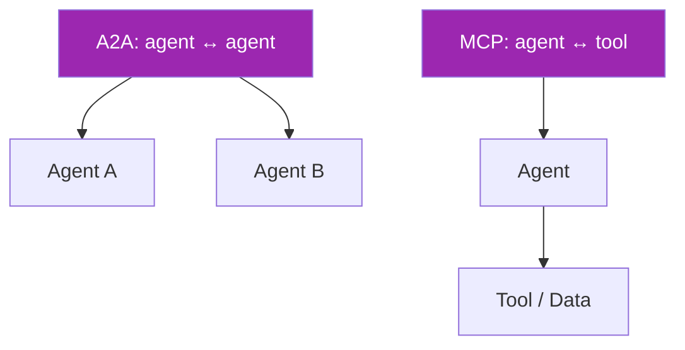
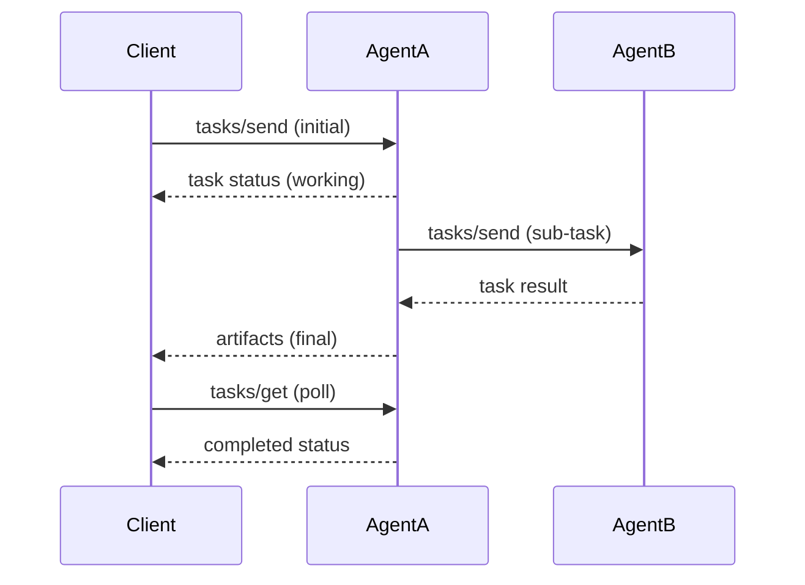
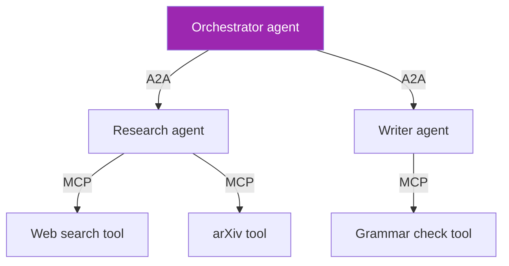

# Day 115: A2A Protocol Deep 🤝

<div class="lesson-meta">
⏱️ 4 ชั่วโมง &nbsp;|&nbsp; 📊 Advanced &nbsp;|&nbsp; 📋 Prerequisites: Day 73
</div>

## 🎯 Learning Objectives

<ul class="objectives">
<li>เข้าใจ A2A vs MCP — when to use which</li>
<li>Build A2A agent card</li>
<li>Implement A2A communication</li>
</ul>

---

## 1. A2A vs MCP — Two Standards, Different Layers



- **MCP**: agent talks to tools/data (server provides capabilities)
- **A2A**: agent talks to agents (orchestration across systems)

Use together:
- A2A: high-level workflow ("research agent" calls "writing agent")
- MCP: low-level tools each agent uses

---

## 2. A2A Origin

A2A (Agent-to-Agent) protocol open-sourced by Google + partners in 2024:
- Open spec
- Backed by major vendors (Atlassian, Salesforce, ServiceNow, etc.)
- Built to interop across agent platforms

→ Goal: agents from different vendors can collaborate

---

## 3. Core Concepts

### Agent Card

Every agent publishes a "card" describing capabilities:

```json
{
  "name": "research-agent",
  "description": "Conducts in-depth web research on topics",
  "version": "1.0.0",
  "url": "https://agents.example.com/research",
  "capabilities": {
    "streaming": true,
    "stateful": true,
    "pushNotifications": false
  },
  "skills": [
    {
      "id": "web_research",
      "name": "Web Research",
      "description": "Search and synthesize web content",
      "tags": ["research", "web"],
      "examples": ["Research latest AI trends"]
    }
  ],
  "defaultInputModes": ["text"],
  "defaultOutputModes": ["text"],
  "authentication": {
    "schemes": ["bearer"]
  }
}
```

Published at: `https://<agent-host>/.well-known/agent.json`

---

## 4. Communication Flow



---

## 5. Server Implementation (Python)

```python
# Using Google ADK or A2A SDK
from a2a_sdk import A2AServer, AgentCard, Task, Message

# Define agent card
card = AgentCard(
    name="research-agent",
    description="In-depth research",
    url="https://my-agent.com",
    skills=[{"id": "web_research", "name": "Web Research", "description": "..."}]
)

class ResearchAgent:
    async def execute(self, task: Task) -> Task:
        question = task.input.get("text")
        
        # Status update (working)
        await task.update_status("working", message="Searching the web...")
        
        # Do work (could call MCP tools, sub-agents, etc.)
        sources = await search_web(question)
        synthesis = await synthesize_with_claude(sources)
        
        # Final artifact
        task.add_artifact({
            "name": "research_report",
            "type": "text",
            "content": synthesis
        })
        await task.update_status("completed")
        return task

server = A2AServer(agent_card=card, executor=ResearchAgent())
server.run(host="0.0.0.0", port=8000)
```

---

## 6. Client Calling Agent

```python
from a2a_sdk import A2AClient

client = A2AClient(base_url="https://agent.example.com")

# Discover capabilities
card = await client.get_agent_card()
print(card.skills)

# Send task
task = await client.send_task({
    "input": {"text": "Research latest LLM evaluation methods"}
})

# Stream updates
async for update in client.stream_task(task.id):
    print(update.status, update.message)

# Get final result
result = await client.get_task(task.id)
print(result.artifacts)
```

---

## 7. Multi-Agent Orchestration via A2A

```python
# Orchestrator agent uses other agents via A2A
class OrchestratorAgent:
    def __init__(self):
        self.research = A2AClient(url="https://research.example.com")
        self.writer = A2AClient(url="https://writer.example.com")
        self.critic = A2AClient(url="https://critic.example.com")
    
    async def execute(self, task):
        question = task.input["text"]
        
        # Step 1: Research
        await task.update_status("working", message="Researching...")
        research_task = await self.research.send_task({"input": {"text": question}})
        research_result = await self.research.wait_for_completion(research_task.id)
        research_content = research_result.artifacts[0]["content"]
        
        # Step 2: Write
        await task.update_status("working", message="Writing...")
        write_task = await self.writer.send_task({
            "input": {"text": f"Write article based on: {research_content}"}
        })
        draft = (await self.writer.wait_for_completion(write_task.id)).artifacts[0]["content"]
        
        # Step 3: Critique + iterate
        critique = (await self.critic.send_task({"input": {"text": draft}})).artifacts[0]["content"]
        if critique["score"] < 8:
            # Revise
            ...
        
        task.add_artifact({"name": "final", "content": draft})
        await task.update_status("completed")
```

→ Cross-vendor: research could be Google ADK, writer could be Anthropic-based, critic could be custom

---

## 8. State Management

A2A supports:
- **Stateless** tasks (one-shot)
- **Stateful** with session IDs
- **Push notifications** (webhooks back to caller when long task completes)

```python
# Stateful session
session_id = "user-123-session-abc"
task = await client.send_task({
    "input": {"text": "Follow up on previous research"},
    "sessionId": session_id  # agent remembers context
})
```

→ Powerful for multi-turn workflows

---

## 9. A2A + MCP Together



- A2A = orchestration between agents
- MCP = tools each agent uses

→ Composable architecture

---

## 10. Differences from Function Calling

| | Tool function call | MCP | A2A |
|--|---|-----|-----|
| Scope | Single agent | Agent ↔ tools | Agent ↔ agents |
| Discovery | Compile-time | Runtime | Runtime |
| State | Stateless | Optional state | Optional state |
| Streaming | Within LLM stream | Native | Native |
| Auth | Custom | OAuth 2.1 spec | OAuth + bearer |
| Vendor lock | None | None | None |
| Maturity | Mature | Stabilizing | Newer |

---

## 🛠️ Hands-on Exercise

!!! example "Exercise 1: Read A2A Spec"
    Read https://a2aproject.org/ — understand agent card structure

!!! example "Exercise 2: Build Agent Card"
    Write agent card for your capstone agent (Day 90)

!!! example "Exercise 3: Multi-Agent Flow"
    Sketch orchestrator → research → write flow using A2A clients

---

## ✅ Self-Check Quiz

<div class="quiz">

**Q1:** MCP and A2A — overlap?

??? success "ดูคำตอบ"
    Different layers:
    - MCP: tools/data → agent
    - A2A: agent → agent
    They complement; you can use both in same system. Agent uses MCP for tools, A2A for delegating to other agents.

**Q2:** Why is open protocol important?

??? success "ดูคำตอบ"
    - Avoid vendor lock-in
    - Mix-and-match best-in-class agents
    - Enterprise can adopt without rewriting if vendor changes
    - Marketplace economics — agents from different providers compose

</div>

---

## 🔍 Cross-check & References

- 📘 [A2A Protocol Site](https://a2aproject.org/)
- 📘 [A2A GitHub](https://github.com/a2aproject)
- 📺 [A2A Introduction (Google)](https://developers.googleblog.com/en/agent-to-agent-protocol/)

[ต่อไป → Day 116: A2A Security :material-arrow-right:](day-116.md){ .md-button .md-button--primary }
