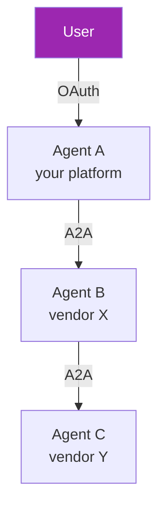

# Day 116: A2A Security & Cross-Vendor 🛡️

<div class="lesson-meta">
⏱️ 3 ชั่วโมง &nbsp;|&nbsp; 📊 Advanced &nbsp;|&nbsp; 📋 Prerequisites: Day 115
</div>

## 🎯 Learning Objectives

<ul class="objectives">
<li>Authenticate A2A communication securely</li>
<li>Trust boundaries across vendors</li>
<li>Cross-vendor identity propagation</li>
</ul>

---

## 1. Trust Model



Questions:
- Does Agent B trust Agent A's claim about user?
- Can user see what Agent C did on their behalf?
- Liability if Agent C misbehaves?

---

## 2. Authentication Patterns

### Pattern 1: Service-to-Service (Mutual Trust)

```python
# Agents in same org / trusted partnership
# Each agent has API key for the other

headers = {
    "Authorization": f"Bearer {SERVICE_TOKEN}",
    "X-User-Id": user.id  # user context passed
}
await a2a_client.send_task(task, headers=headers)
```

→ Simple, but B fully trusts A about user identity

### Pattern 2: OAuth Token Exchange

```python
# A obtains token specifically for calling B (RFC 8693)
exchange_resp = await idp.token_exchange(
    subject_token=user_token,  # user's token at A
    audience=AGENT_B_URI,
    requested_token_type="urn:ietf:params:oauth:token-type:access_token",
    scope="agent_b.tasks.send"
)

# A calls B with B-specific token
b_token = exchange_resp["access_token"]
await a2a_client_for_b.send_task(task, auth=b_token)
```

→ Cryptographic proof B can verify; user consent enforced at A

### Pattern 3: User-Approved Delegation

```python
# UI: "Agent A wants to use Agent B on your behalf"
# User explicitly approves → token issued for cross-agent call
```

→ Highest user awareness; best for new/untrusted agents

---

## 3. User Identity Propagation

```python
# Pattern: Identity assertion in task metadata
task = {
    "input": {"text": "..."},
    "metadata": {
        "user_id": user.id,
        "user_email": user.email,  # only if needed and consented
        "tenant_id": user.tenant_id,
        "session_id": session.id,
        # Signed claim from trusted IdP
        "identity_token": signed_jwt_from_idp
    }
}

# Receiving agent verifies signature
identity = await verify_jwt(task.metadata["identity_token"], expected_issuer=...)
```

→ B-side can verify and audit who actually requested the work

---

## 4. Capability-Limited Delegation

```python
# Delegate ONLY specific capabilities
delegation_token = await issue_delegation(
    grantor=user,
    grantee=agent_b,
    scopes=["read_calendar"],  # NOT write, NOT delete
    expires_in=3600,
    can_redelegate=False  # B can't pass to C
)

await a2a_client.send_task(task, auth=delegation_token)
```

→ Even if B is compromised, blast radius limited

---

## 5. Audit Across Boundaries

```python
# Every agent logs its actions
# Use correlation ID to trace cross-agent flow

correlation_id = task.metadata["correlation_id"]

audit_log({
    "agent": "agent-b",
    "received_from": task.metadata["sender_agent"],
    "user": task.metadata["user_id"],
    "correlation_id": correlation_id,
    "task_input_hash": hash(task.input),
    "action_taken": "...",
    "timestamp": now()
})

# Aggregated audit log spans agents — full chain of custody
```

→ User asks "who did what" → assemble timeline across agents

---

## 6. Cross-Vendor Considerations

### Discovery & Trust Registry

```python
# How does A know B's agent card URL is the real one?

# Option 1: Hardcoded allowlist
KNOWN_AGENTS = {
    "research-agent.example.com": {"public_key": "..."}
}

# Option 2: DNSSEC + well-known
# Fetch https://example.com/.well-known/agent.json
# Verify TLS cert + maybe additional signing

# Option 3: Centralized registry (developing standard)
# An "agent marketplace" with verified entries
```

### Schema Negotiation

```python
# Skills evolve — agents must handle older clients
card = {
    "skills": [{
        "id": "research_v2",
        "version": "2.1",
        "compatibility": ["research_v1"]  # accepts old input format
    }]
}
```

---

## 7. Failure Modes & Defense

```python
# Defensive A2A client

class SafeA2AClient:
    def __init__(self, url, timeout=30):
        self.url = url
        self.timeout = timeout
    
    async def send_task(self, task):
        # 1. Validate response card freshness
        card = await self.get_card()
        if not self.trust_card(card):
            raise UntrustedAgent(card.url)
        
        # 2. Timeout
        try:
            result = await asyncio.wait_for(
                self._send(task),
                timeout=self.timeout
            )
        except asyncio.TimeoutError:
            return {"status": "timeout", "fallback": "..."}
        
        # 3. Validate response schema
        if not validate_schema(result, expected_schema):
            raise InvalidResponse(result)
        
        # 4. Sanitize outputs (don't trust)
        sanitized = sanitize_text(result["artifacts"])
        return sanitized
    
    def trust_card(self, card):
        # Verify cert, signing, allowlist, etc.
        return card.url in ALLOWED_AGENTS
```

---

## 8. Adversarial Considerations

Threats unique to A2A:
- **Malicious agent** in the chain (poisons output)
- **Token replay** (capture cross-agent token, reuse)
- **Schema confusion** (B sends unexpected output structure)
- **Identity spoofing** (B claims user requested when they didn't)
- **Resource exhaustion** (recursive agent calls, fan-out)

Defenses:
- Allowlist + signed agent cards
- Short token lifetimes + audience binding
- Schema validation everywhere
- Identity tokens signed by trusted IdP only
- Call depth limit + rate limits

---

## 9. Privacy Across Agents

```python
# Question: when A sends task to B, what user data goes?

# Default: minimize
task = {
    "input": {"text": user_question},
    "metadata": {
        "session_id": "...",  # opaque
        "tenant_id": "..."     # if needed for routing
        # NO: user email, name, etc. unless agent B specifically needs
    }
}

# If B needs more, B requests separately via OAuth → user consents
```

User data minimization across boundaries

---

## 10. Real-World Patterns

### Pattern: Workflow Choreography

```python
# User's primary agent (Atlassian agent, say)
# Coordinates work across:
#   - Salesforce agent (customer data)
#   - ServiceNow agent (ticket creation)  
#   - Custom agent (internal logic)

# All cross-vendor via A2A
# User logged in once → tokens propagated via exchange
# Single audit trail across all
```

### Pattern: Agent Marketplace

```python
# Like API marketplace, but for agents
# Discover, evaluate, integrate
# Pricing per task / month
# SLA / SLO published
# Compliance certifications visible
```

---

## 🛠️ Hands-on Exercise

!!! example "Exercise 1: Token Exchange"
    Implement OAuth token exchange between 2 agents (use Auth0 / Keycloak)

!!! example "Exercise 2: Identity Propagation"
    Build identity JWT signing + verification across agents

!!! example "Exercise 3: Defensive Client"
    Build A2A client with timeout, schema validation, sanitization

---

## ✅ Self-Check Quiz

<div class="quiz">

**Q1:** ทำไม service tokens (Pattern 1) ไม่พอ?

??? success "ดูคำตอบ"
    - No cryptographic proof user actually authorized cross-agent call
    - Agent A can impersonate any user to Agent B
    - Audit shows "Agent A did X" but not why or whose user
    - For untrusted partner agents, dangerous

**Q2:** Token exchange (RFC 8693) ใช้ทำอะไร?

??? success "ดูคำตอบ"
    - User authorizes at A with their token
    - A exchanges for token scoped to B (specific audience)
    - B verifies signature + audience → confirms legit
    - User consent enforced at IdP (could restrict which sub-agents)
    - Audit trail: cryptographic chain

</div>

---

## 🔍 Cross-check & References

- 📘 [A2A Security](https://a2aproject.org/security)
- 📘 [RFC 8693 (OAuth Token Exchange)](https://datatracker.ietf.org/doc/html/rfc8693)
- 📘 [Cross-vendor agent auth patterns](https://www.openid.net/)

[ต่อไป → Day 117: Build Enterprise MCP (Part 1) :material-arrow-right:](day-117.md){ .md-button .md-button--primary }
