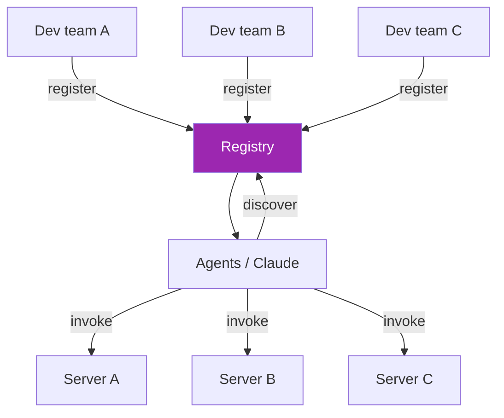
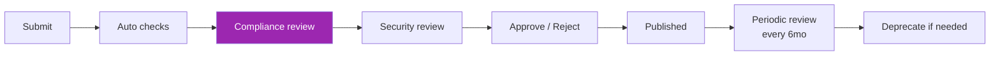
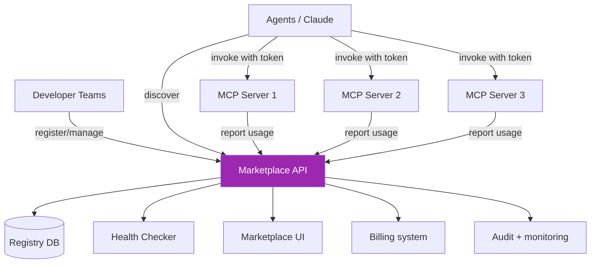

# Day 119: MCP Marketplace 🏪

<div class="lesson-meta">
⏱️ 5 ชั่วโมง &nbsp;|&nbsp; 📊 Project &nbsp;|&nbsp; 📋 Prerequisites: Day 117-118
</div>

## 🎯 Goal

Build internal MCP marketplace ที่ทีมต่างๆ publish + consume tools

---

## 1. Concept



Capabilities:
- Server registration with metadata
- Discovery via UI / API
- Governance (approvals, deprecation)
- Per-server health + SLA
- Audit usage across servers

---

## 2. Registry Schema

```python
from pydantic import BaseModel
from typing import Literal

class ServerEntry(BaseModel):
    id: str
    name: str
    description: str
    owner_team: str
    contact: str  # email / Slack channel
    
    # Connection
    url: str
    transport: Literal["stdio", "http"]
    
    # Capabilities
    tools: list[dict]  # cached from server discovery
    auth_required: list[str]  # OAuth scopes
    
    # Governance
    status: Literal["draft", "approved", "deprecated", "retired"]
    approval_history: list[dict]
    compliance_review: dict  # date, reviewer, status
    
    # Health
    sla_uptime: float  # e.g., 0.995
    sla_latency_p95_ms: int
    last_health_check: str
    
    # Usage
    tags: list[str]  # e.g., ["finance", "support"]
    visibility: Literal["public", "team-only", "private"]
    allowed_teams: list[str]
    
    # Metadata
    version: str
    created_at: str
    updated_at: str
```

---

## 3. Registry API

```python
# registry/server.py
from fastapi import FastAPI, Depends, HTTPException
from typing import List

app = FastAPI(title="MCP Marketplace")

@app.post("/api/servers")
async def register_server(entry: ServerEntry, user=Depends(get_user)):
    # Validate URL reachable + advertises agent card
    try:
        cap = await fetch_server_capabilities(entry.url)
        entry.tools = cap.tools
    except Exception as e:
        raise HTTPException(400, f"Server unreachable: {e}")
    
    # Owner must be valid team
    if not is_team_member(user, entry.owner_team):
        raise HTTPException(403, "Must be member of owner team")
    
    entry.status = "draft"
    entry.approval_history = []
    
    db.insert_server(entry)
    return entry

@app.get("/api/servers", response_model=List[ServerEntry])
async def list_servers(
    tag: str | None = None,
    team: str | None = None,
    status: str = "approved",
    user=Depends(get_user)
):
    servers = db.query_servers(status=status, tag=tag, team=team)
    
    # Filter by visibility
    return [s for s in servers if can_access(user, s)]

@app.post("/api/servers/{server_id}/approve")
async def approve_server(server_id: str, user=Depends(get_user)):
    if not user.has_role("marketplace_admin"):
        raise HTTPException(403)
    
    server = db.get_server(server_id)
    server.status = "approved"
    server.approval_history.append({
        "by": user.id,
        "at": now(),
        "compliance_review_complete": True
    })
    db.update_server(server)
    
    # Notify
    notify_team(server.owner_team, f"Server {server.name} approved")
```

---

## 4. Health Monitoring

```python
# Background job: ping each registered server
@app.on_event("startup")
async def start_health_checker():
    asyncio.create_task(health_check_loop())

async def health_check_loop():
    while True:
        servers = db.query_servers(status="approved")
        for s in servers:
            try:
                async with timeout(10):
                    r = await httpx.get(f"{s.url.rstrip('/mcp')}/health")
                    healthy = r.status_code == 200
                    latency_ms = (r.elapsed.total_seconds() * 1000)
            except:
                healthy = False
                latency_ms = None
            
            db.update_health(s.id, healthy, latency_ms)
            
            if not healthy:
                notify_team(s.owner_team, f"Server {s.name} unhealthy")
        
        await asyncio.sleep(60)
```

Dashboards show:
- Per-server uptime (rolling 30 days)
- P95 latency trend
- Usage by consumer

---

## 5. Discovery UI

```tsx
// app/marketplace/page.tsx
export default function Marketplace() {
  const [filter, setFilter] = useState({tag: null, team: null});
  const { data: servers } = useSWR(`/api/servers?tag=${filter.tag || ""}`);
  
  return (
    <div>
      <input placeholder="Search..." />
      <div className="filters">{/* tag chips */}</div>
      
      <div className="grid">
        {servers?.map(s => (
          <div key={s.id} className="card">
            <h3>{s.name}</h3>
            <p>{s.description}</p>
            <p>Owner: {s.owner_team}</p>
            <p>Tools: {s.tools.length}</p>
            <p>Status: {healthBadge(s)}</p>
            <button onClick={() => useInClaude(s)}>Use in Claude</button>
          </div>
        ))}
      </div>
    </div>
  );
}
```

---

## 6. "Use in Claude" — Auto-Connect

```python
@app.post("/api/servers/{server_id}/connect")
async def connect_to_claude(server_id: str, user=Depends(get_user)):
    server = db.get_server(server_id)
    
    if not can_access(user, server):
        raise HTTPException(403)
    
    # Mint user token for that server
    token = await mint_user_token(user, audience=server.url)
    
    # Return MCP connection config for Claude SDK / Desktop
    return {
        "name": server.name,
        "url": server.url,
        "auth": f"Bearer {token}"
    }
```

User clicks "Use in Claude" → copies into Claude config or auto-injects via API

---

## 7. Governance Workflow



Auto checks:
- Server reachable
- Agent card valid
- TLS configured
- Health endpoint exists
- No PII in tool descriptions

Manual review:
- Compliance: data handling per policy
- Security: pen test results
- Architecture: align with standards
- Cost: budget approval

---

## 8. Cost Attribution

```python
# Track usage per server per consumer
@app.post("/api/usage")
async def report_usage(usage: UsageRecord, _=Depends(verify_consumer_token)):
    db.record_usage(usage)
    
    # Bill consumer team budget
    if usage.tokens or usage.cost_usd:
        await bill_team(usage.consumer_team, usage.cost_usd)

class UsageRecord(BaseModel):
    server_id: str
    consumer_team: str
    user_id: str
    tool: str
    tokens: int | None
    cost_usd: float
    duration_ms: int
    timestamp: str
```

→ Internal "billing" — teams see what they spend across servers

---

## 9. Lifecycle Management

```python
# Deprecation
@app.post("/api/servers/{server_id}/deprecate")
async def deprecate(server_id: str, deprecation_date: str, migration_target: str, user=Depends(get_user)):
    server = db.get_server(server_id)
    server.status = "deprecated"
    server.deprecation_info = {
        "date": deprecation_date,
        "migration_to": migration_target,
        "notice_period_days": 90
    }
    db.update_server(server)
    
    # Notify all consumers
    consumers = db.find_active_consumers(server_id, last_n_days=30)
    for c in consumers:
        notify_team(c, f"Server {server.name} deprecated. Migrate to {migration_target} by {deprecation_date}")
```

→ 90-day notice typical for internal services

---

## 10. Final Architecture Diagram



---

## 🛠️ Day 119 Deliverables

- [ ] Registry API (CRUD + approve + health + usage)
- [ ] Marketplace UI (discovery + connect)
- [ ] Health check loop
- [ ] Governance workflow doc
- [ ] Cost attribution model
- [ ] Lifecycle management (deprecate / retire)
- [ ] At least 3 MCP servers registered
- [ ] Demo: developer registers → admin approves → agent uses

[ต่อไป → Day 120: Course Finale :material-arrow-right:](day-120.md){ .md-button .md-button--primary }
