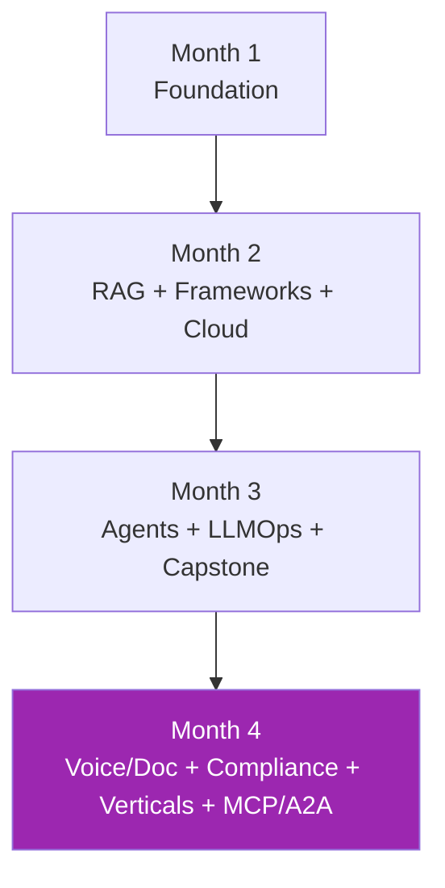
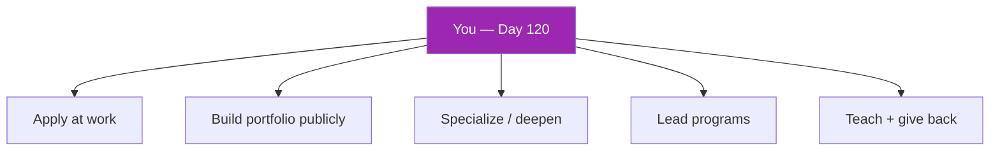

# Day 120: Course Finale 🎓

<div class="lesson-meta">
⏱️ 3 ชั่วโมง &nbsp;|&nbsp; 📊 Capstone &nbsp;|&nbsp; 📋 Prerequisites: Days 1-119
</div>

## 🎯 Goal

Synthesize 120 days, plan ongoing learning + work application

---

## 1. What You've Built



### Skills inventory

By Day 120, you can:
- ✅ Build production RAG (vector + hybrid + GraphRAG)
- ✅ Build agents with LangGraph / LlamaIndex / DSPy / Pydantic
- ✅ Deploy on Bedrock / Vertex / Foundry (multi-cloud)
- ✅ Run LLMOps (observability, eval, red team, guardrails, cost)
- ✅ Build voice agents (LiveKit) + document AI (LandingAI)
- ✅ Navigate compliance (NIST RMF, EU AI Act, PDPA, HIPAA)
- ✅ Apply vertical patterns (support, code, legal, finance, health, edu)
- ✅ Implement MCP servers with OAuth + multi-tenant
- ✅ Use A2A protocol for cross-vendor agent integration

---

## 2. Capstone Portfolio

You should have:

```
Portfolio/
├── capstone-v1 (Day 27-30)         — multi-step agent
├── capstone-v2 (Day 82-90)         — enterprise RAG + agents
├── voice-doc-project (Day 97)      — voice + doc workflow
├── mcp-marketplace (Day 119)       — MCP registry
└── compliance-bundle (Day 104)     — audit-ready docs
```

→ Strong portfolio for SA / AI architect roles

---

## 3. SA Career Application

As a Solution Architect, you can now lead:

### Discovery
- AI use case classification (risk tier, framework alignment)
- Stakeholder workshops with informed POV
- Architecture proposals with measured trade-offs

### Design
- Multi-cloud reference architectures
- Compliance-first design from day 1
- Cost + carbon modeling

### Delivery
- LLMOps pipeline templates
- Production runbooks
- Vendor evaluation (frameworks, clouds, tools)

### Governance
- AI Center of Excellence setup
- Policy authoring
- Cross-team enablement

---

## 4. Stay Current — Recommended Sources

```markdown
# Weekly check-ins

## Anthropic
- docs.claude.com — Anthropic docs (capabilities, pricing)
- anthropic.com/news — product launches
- anthropic.com/research — papers + announcements

## Frameworks (track major releases)
- LangChain blog
- LlamaIndex blog
- Hugging Face newsletter

## Compliance
- EU AI Act updates
- NIST AI RMF revisions
- IAPP (privacy)

## Research
- arXiv cs.CL + cs.AI (weekly skim)
- AlphaSignal newsletter
- Latent Space podcast

## Practitioner
- Vicki Boykis blog
- Lilian Weng (OpenAI) blog
- Eugene Yan blog
- Chip Huyen blog
- Anthropic engineering blog
```

---

## 5. Communities

- Anthropic Discord
- r/LocalLLaMA (open source)
- AI Engineer Slack
- Hugging Face community
- LinkedIn AI thought leaders
- Local meetups (AWS, GDG, Anthropic Builders)

---

## 6. Continuing Education

### Tier 1 (next 6 months)
- Andrew Ng / DeepLearning.AI: any new courses on agents
- Anthropic Academy: ongoing additions
- Cloud certifications: AWS ML Specialty, GCP Professional ML Engineer

### Tier 2 (1-2 years)
- Specialization: pick 1 vertical you'll focus on
- Advanced topics: model fine-tuning, RLHF, custom models
- Adjacent: distributed systems, data engineering at scale

### Tier 3 (research)
- Conference: NeurIPS, ICML, ICLR papers
- Open source contributions (LangChain, MCP, A2A)

---

## 7. Career Levels — What Each Looks Like

### IC / Senior Engineer
- Build features end-to-end
- Own service quality
- Mentor juniors

### Staff / Principal
- Design across services
- Influence org-wide patterns
- Author standards

### Architect (where this course aims)
- Multi-domain (RAG, agents, voice, doc, compliance)
- Cost + carbon + quality in one model
- Translate business → technical → back
- Vendor-agnostic but opinionated

### Distinguished / Fellow
- Industry-level influence
- New patterns / OSS / publications
- Cross-org transformations

---

## 8. Personal Brand (Optional)

If career growth matters:
- Write 1 technical blog post per quarter (sharing what you built)
- Open-source 1 tool / pattern per year
- Speak at meetup / conference 1×/year
- Mentor publicly (Discord, internal)

→ Compounds dramatically over 2-5 years

---

## 9. 30 / 60 / 90 Day Plan Post-Course

```markdown
# After-Course Plan

## Day 1-30
- Apply 1 pattern from this course at work
- Refine capstone with feedback
- Pick stretch area to deepen (e.g., A2A, doc AI)

## Day 31-60
- Propose a project at work using course patterns
- Build PoC + measure
- Get stakeholder feedback

## Day 61-90
- Production deploy of PoC
- Document outcomes
- Share learnings (blog / internal talk)

## Quarterly review
- What's working?
- What's outdated (LLM space moves fast)?
- Next 90 days?
```

---

## 10. Final Reflection

```markdown
# Self-Assessment

## Strongest now
- [ ] RAG architectures
- [ ] Agent orchestration
- [ ] Cloud platforms
- [ ] LLMOps
- [ ] Voice / Doc AI
- [ ] Compliance
- [ ] Verticals
- [ ] MCP / A2A

## To deepen
- [ ] _____
- [ ] _____
- [ ] _____

## To apply (next quarter at work)
- Project 1: _____
- Project 2: _____

## Long-term direction
- Vertical specialization: _____
- Or generalist architect: _____
```

---

## 🎉 Congratulations

You've completed 120 days, ~360-450 hours of focused study covering:

- 16 weeks of content
- 8+ frameworks
- 3 major clouds
- 6 vertical playbooks
- 2 capstone projects
- Full compliance bundle

You're now positioned as a **senior AI solution architect** capable of leading end-to-end LLM programs at enterprise scale.

---

## 🔍 Cross-check & References

- 📘 Recap all references throughout days 1-119
- 📘 [Anthropic Academy](https://www.anthropic.com/learn)
- 📘 [LangChain Academy](https://academy.langchain.com/)
- 📘 [DeepLearning.AI](https://www.deeplearning.ai/courses/)

---

## What's Next



The journey doesn't end here — it begins.

🚀 **Go build something meaningful.**

---

[← กลับสู่ Home](../index.md){ .md-button }
[ดู Curriculum รวม](../curriculum.md){ .md-button }
