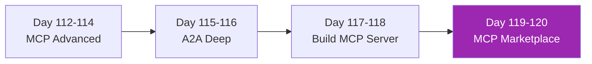

# Week 16: Advanced MCP & A2A 🔌

Final week — build enterprise-grade integration protocols

| Day | หัวข้อ | เวลา |
|-----|--------|------|
| 112 | MCP advanced — transports, Streamable HTTP | 3h |
| 113 | MCP OAuth + multi-tenant | 4h |
| 114 | MCP scaling + ops | 3h |
| 115 | A2A protocol deep | 4h |
| 116 | A2A security + cross-vendor | 3h |
| 117 | Building enterprise MCP server (part 1) | 4h |
| 118 | Building enterprise MCP server (part 2) | 4h |
| 119 | Mini-project — MCP marketplace pattern | 5h |
| 120 | Course finale + roadmap | 3h |

[เริ่ม Day 112 :material-arrow-right:](day-112.md){ .md-button .md-button--primary }
